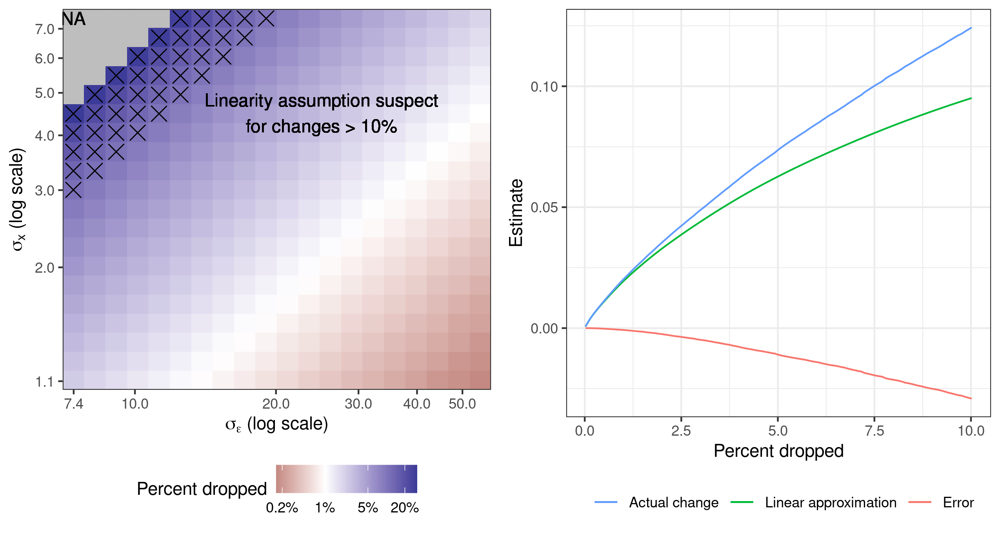

# Introduction

Ideally, policymakers will use economics research to inform decisions that affect people's livelihoods, health, and well-being. Yet study samples may differ from the target populations of these decisions in non-random ways, perhaps because of practical challenges in obtaining truly random samples, or because populations generally differ across time and place. When these deviations from the ideal random sampling exercise are small, one might think that the empirical conclusions would still hold in the populations affected by policy. It therefore seems prudent to ask whether a small percentage of a study's sample---or a handful of data points---has been instrumental in determining its findings. In this paper we provide a finite-sample, automatically-computable metric of how dropping a small amount of data can change empirical conclusions. We show that certain empirical results from high-profile studies in economics can be reversed by removing less than 1% of the sample even when standard errors are small, and we investigate why.

There are several reasons to care about whether empirical conclusions are substantially influenced by small percentages of the finite sample. In practice, even if we can sample from the population of direct interest, small percentages of the data are missing; either surveyors and implementers cannot find these individuals, or they refuse to answer our questions, or their answers get lost or garbled during data processing. As this missingness cannot safely be assumed random, researchers might care whether their substantive conclusions could conceivably be overturned by a missing handful of data points. Similarly, consumers of research who are concerned about potentially non-random errors in sample construction at any stage of the analysis might be interested in this metric as a measure of the exposure of a study's conclusions to this concern. Conclusions that are highly influenced by a small handful of data points are more exposed to adverse events or errors during data analysis, including p-hacking, even if these errors are unintentional.

Even if researchers could construct a perfectly random sample from a given study population, the target population for our policy decisions is almost always different from the study population, if only because the world may change in the time between the research and the decision. For this reason, social scientists often aspire to uncover generalizable or "externally valid" truths about the world and to make policy recommendations that would apply more broadly than to a single study population.

In this paper, we propose to directly measure the extent to which a small fraction of a data sample has influenced the central claims or conclusions of a study. For a particular fraction $\alpha$ (e.g., $\alpha = 0.001$), we propose to find the set of no more than $100 \alpha \%$ of all the observations that effects the greatest change in an estimator when those observations are removed from the sample, and to report this change. For example, suppose we were to find a statistically-significant average increase in household consumption after implementing some economic policy intervention. Further suppose that, by dropping 0.1% of the sample (often fewer than 10 data points), we instead find a statistically-significant average *decrease* in consumption. Then it would be challenging to argue that there is strong evidence that this intervention would yield consumption increases in even slightly different populations.

To quantify this sensitivity, one could consider every possible $1-\alpha$ fraction of the data, and re-run the original analysis on all of these data subsets. But this direct implementation is computationally prohibitive.[^1] We propose a fast approximation that works for common estimators---including Generalized Methods of Moments (GMM), Ordinary Least Squares (OLS), Instrumental Variables (IV), Maximum Likelihood Estimators (MLE), Variational Bayes (VB), and all minimizers of smooth empirical loss (). Computation of the approximation is fast, automatable, and easy to use, and we provide an R package on GitHub called "zaminfluence."[^2]

Our approximation is based on the classical "influence function," which has been used many times in the literature to assess sensitivity to dropping one or a small number of datapoints (a discussion of related work can be found in below). However, prior work focused on outlier detection and visual diagnostics and considered small numbers of removed datapoints. In contrast, we relate the effect of ablating a non-vanishing proportion of datapoints to classical inference, with an interest in generalizing to unseen populations rather than detection of gross outliers, and analyze the accuracy of the empirical influence function as an approximation to leaving out a fixed proportion of data.

Specifically, we show that our approximation performs well using a combination of theoretical analyses, simulation studies, and applied examples. We demonstrate theoretically that the approximation error is low when the percentage of the sample removed is small (). Moreover, for the cost of a single additional data analysis, we can provide an exact lower bound on the worst-case change in an analysis upon removing $100\alpha \%$ of the data (). We check that our metric detects combinations of data points that reverse empirical conclusions when removed from real-life datasets (). For example, in the Oregon Medicaid study (Finkelstein et al. 2012), we can identify a subset containing less than 1% of the original data that controls the sign of the effects of Medicaid on certain health outcomes. In the Mexico microcredit study (Angelucci et al. 2015), we find a single observation, out of 16,500, that controls the sign of the ATE on household profit.

We investigate the source of this sensitivity when it arises, and we show that it is not captured in conventional standard errors. We find that a result's exposure to the influence of a small fraction of the sample need not reflect a model misspecification problem nor the presence of gross outliers. Sensitivity according to our metric can arise, even if the model is exactly correct and the data set arbitrarily large, if there is a low *signal-to-noise ratio*: that is, if the strength of the claim (signal) is small relative to a quantity that consistently estimates the standard deviation of the limiting distribution of root-$N$ times the quantity of interest (). For example, in OLS this "noise" is large when we have a high ratio of residual variance to regressor variance (). This noise can be large even when standard errors are small, because it does not disappear as $N$ grows. This result highlights the distinction between performing classical inference within a hypothetical perfect random resampling experiment, and attempting to generalize beyond the data to the world in which very small changes to the population are occurring over space and time.

We examine several applications from empirical economics papers and find that the sensitivity captured by our metric varies considerably across analyses in practice. In many cases, the sign and significance of certain estimated treatment effects can be reversed by dropping less than 1% of the sample, even when the t-statistics are very large and inference is very precise; see, e.g., the Oregon Medicaid RCT (Finkelstein et al. 2012) in . In , we examine the Progresa Cash Transfers RCT (Angelucci and De Giorgi 2009) and show that trimming outliers in the outcome data does not necessarily reduce sensitivity. In we examine a simple two-parameter linear regression on seven Microcredit RCTs (Meager 2020) and, in , we examine a Bayesian hierarchical analysis of the same data; these final two analyses show that neither very simple nor relatively complex Bayesian models are immune to sensitivity to dropping small fractions of the data. However, not all analyses we examine are non-robust. Certain results across the applications we examine are robust up to 5% and even 10% removal.

We recommend that researchers use our metric to complement standard errors and other robustness checks. Our goal is not to supplant other sensitivity analyses, but to provide an additional tool to be incorporated into a broader ecosystem of systematic stability analysis in data science (Yu 2013). For example, since our approximation is fundamentally local due to the Taylor expansion, practitioners may also consider global sensitivity checks such as those proposed by Leamer (1984, 1985; Sobol 2001; Saltelli 2004), or the conventional breakdown frontiers approach of He et al. (1990; Masten and Poirier 2020). Our method is also not a substitute for tailored robustness checks designed by researchers to investigate specific concerns about sensitivity of results to certain structures or assumptions. Applied researchers will always know more than econometricians about which specific threats to their empirical strategies are most worth investigating in order to solidify our trust in the results of any given analysis. And practitioners may well benefit from robustifying their analysis (Mosteller and Tukey 1977; Hansen and Sargent 2008; Chen et al. 2011) even if they pass our check. Our metric is also complementary to classical gross error robustness (which we take to include outlier detection and breakdown point analyses) (Belsley et al. 1980; Hampel et al. 1986). In particular, gross error sensitivity is designed to detect and accommodate arbitrary adversarial perturbations to the population distribution. We discuss similarities and differences between our work and other robustness measures in detail in .

We do not recommend researchers discard results that are not robust to removal of a small, highly-influential subset of data. While in certain cases such sensitivity may be concerning for specific, contextually-determined reasons, there is as yet no basis for doing so in general, as we have shown that such sensitivity can arise even if the conventional inference is valid in the strictest sense. However, we do suggest that researchers adjust their interpretation of results which are sensitive to dropping a small fraction of the data as being less generally applicable to somewhat differing populations, and less robust to minor corruptions of their random sampling assumption. Much as one would interpret statistically insignificant results as a failure to detect an effect rather than positively detecting the absence of an effect, sensitive results may indicate a failure to detect a transportable effect, but not necessarily a failure of classical inference in itself. We do not yet recommend any specific alterations to common inferential procedures based on our metric, but we believe this direction is promising for future research.

# A proposed measure of sensitivity to dropping small data subsets

Suppose we observe $N$ data points $d_{1}, \ldots, d_{N}$. For instance, in a regression problem, the $n$-th data point might consist of covariates $x_n$ and response(s) $y_n$, with $d_n = (x_n,y_n)$. Consider a parameter $\theta \in
\mathbb{R}^{P}$ of interest. Typically we estimate $\theta$ via some function $\hat{\theta}$ of our data. The central claim of an empirical economics paper is typically focused on some attribute of $\theta$, such as the sign or significance of a particular effect or quantity. A frequentist analyst might be worried if removing some small fraction $\alpha$ of the data were to

- Change the sign of an effect.

- Change the significance of an effect.

- Generate a significant result of the opposite sign.

To capture these concerns, we define the following quantities:

**Definition 1**. Let the *Maximum Influence Perturbation* be the largest possible change induced in the quantity of interest by dropping no more than 100$\alpha$% of the data.

We will often be interested in the set that achieves the Maximum Influence Perturbation, so we call it the *Most Influential Set*.

And we will be interested in the minimum data proportion $\alpha \in [0,1]$ required to achieve a change of some size $\Delta$ in the quantity of interest, so we call that $\alpha$ the *Perturbation-Inducing Proportion*. We report $\texttt{NA}$ if no such $\alpha$ exists.

In general, to compute the Maximum Influence Perturbation for some $\alpha$, we would need to enumerate every data subset that drops no more than 100$\alpha$% of the original data. And, for each such subset, we would need to re-run our entire data analysis. If $m$ is the greatest integer smaller than 100$\alpha$, then the number of such subsets is larger than $\binom{N}{m}$. For $N = 400$ and $m=4$, $\binom{N}{m} = 1.05 * 10^9$. So computing the Maximum Influence Perturbation in even this simple case requires re-running our data analysis over 1 billion times. If each data analysis took 1 second, computing the Maximum Influence Perturbation would take over 33 years to compute. Indeed, the Maximum Influence Perturbation, Most Influential Set, and Perturbation-Inducing Proportion may all be computationally prohibitive even for relatively small analyses.

To address this computational issue, we propose to instead use a (fast) approximation to the Maximum Influence Perturbation, Most Influential Set, and Perturbation-Inducing Proportion. We will see, for the cost of one additional data analysis, our approximation can provide a lower bound on the exact Maximum Influence Perturbation. More generally we provide theory and experiments to support the quality of our approximation. We provide open-source code[^3] and show that our approximation is fully automatable in practice ().

We articulate our approximation in below. First, in to follow we derive a Taylor series approximation to the act of leaving out datapoints. Though this approximation is based on a well-known first-order Taylor series approximation to the act of leaving out datapoints, known as the *empirical influence function* (Hampel 1974; Hampel et al. 1986), we will assume no familiarity with this work, deferring discussion of related literature to . We then define our approximation to data dropping in , using the observation that the finding the Maximum Influence Perturbation and its related quantities is trivial for the Taylor series approximation. We then conclude this section with some simple, concrete examples of our approximation in .

## A Taylor series approximation to dropping data

We begin by a deriving a Taylor series approximation to the act of dropping data. Though this approximation is well-known as the empirical influence function (see below for more details), we will derive the approximation assuming no prior knowledge other than ordinary multivariate calculus.

To form a Taylor series, we will naturally require certain aspects of our estimator to be differentiable. We now summarize common assumptions under which the Taylor expansion exists, and note that many common analyses satisfy these assumptions---including, but not limited to, typical settings for OLS, IV, GMM, MLE, and variational Bayes. Below, in , we will state stricter sufficient conditions that guarantee not only the existence but also the finite-sample accuracy of our approximation.

**Assumption 1**. *$\hat{\theta}$ is a *Z-estimator*; that is, $\hat{\theta}$ is the solution to the following estimating equation,[^4] where $G(\cdot, d_{n}): \mathbb{R}^{P} \rightarrow \mathbb{R}^{P}$ is a twice continuously differentiable function and $0_{P}$ is the column vector of $P$ zeros. $$\begin{align}

%
\sum_{n=1}^NG(\hat{\theta}, d_{n}) =  0_{P}.
%
\end{align}$$*

**Assumption 2**. *$\phi: \mathbb{R}^{P} \rightarrow \mathbb{R}$, which we interpret as a function that takes the full parameter $\theta$ and returns the quantity of interest from $\theta$, is continuously differentiable.[^5]*

For instance, the function that picks out the $p$-th effect from the vector $\theta$, $\phi(\theta) = \theta_{p}$, satisfies this assumption.

To form a Taylor series approximation to the act of leaving out datapoints, we introduce a vector of data weights, $\vec{w}= (w_1, \ldots, w_N)$, where $w_n$ is the weight for the $n$-th data point. We recover the original data set by giving every data point a weight of 1: $\vec{w}= \vec{1}= (1, \ldots, 1)$. We can denote a subset of the original data as follows: start with $\vec{w}= \vec{1}$; then, if the data point indexed by $n$ is left out, set $w_n = 0$. We can collect weightings corresponding to all data subsets that drop no more than 100$\alpha$% of the original data as follows: $$\begin{align}

	W_\alpha &:=
	\left\{ \vec{w}: \textrm{No more than }
 		   \lfloor \alpha N \rfloor \textrm{ elements of } \vec{w}\textrm{ are } 0
			\textrm{ and the rest are } 1 \right\}.
\end{align}$$ Our approximation will be to form a Taylor expansion of our quantity of interest $\phi$ as a function of the weights, rather than recalculate $\phi$ for each data subset (i.e., for each reweighting).

To that end, we first reformulate our setup, now with the weights $\vec{w}$; note that we recover the original problem (for the full data) above by setting $\vec{w}=\vec{1}$ in what follows. Let $\hat{\theta}(\vec{w})$ be our parameter estimate at the weighted data set described by $\vec{w}$. Namely, $\hat{\theta}(\vec{w})$ is the solution to the weighted estimating equation $$\begin{align}

	\sum_{n=1}^Nw_n G(\hat{\theta}(\vec{w}), d_{n}) = 0_{P}.
\end{align}$$ We allow that the quantity of interest $\phi$ may depend on $\vec{w}$ not only via the estimator $\theta$, so we optionally write $\phi(\theta, \vec{w})$ with $\phi(\cdot,\cdot): \mathbb{R}^{P} \times \mathbb{R}^N \rightarrow
\mathbb{R}$. Whenever we write $\phi(\cdot)$ as a function of a single argument, we will implicitly mean $\phi(\cdot, \vec{1})$. We require that $\phi(\cdot,\cdot)$ be continuously differentiable in both its arguments. For instance, we can use $\phi(\theta,\vec{w}) = \theta_{p}$ to pick out the $p$-th component of $\theta$. Or, to consider questions of statistical significance, we may choose $\phi(\theta,\vec{w}) = \theta_{p} +
1.96 \sigma_{p}(\theta,\vec{w})$, where $\sigma_{p}(\theta,\vec{w})$ is an estimate of the standard error depending smoothly on $\theta$ and $\vec{w}$; this example is our motivation for allowing the more general $\vec{w}$ dependence in $\phi(\theta,
\vec{w})$.

With this notation in hand, we can restate our original goal of computing the Most Influential Set as solving $$\begin{align}

	\vec{w}^{**} &:=
	\mathop{\mathrm{arg\,max}}_{\vec{w}\in W_\alpha}
   		 \left( \phi(\hat{\theta}(\vec{w}), \vec{w}) - \hat{\phi}\right).
\end{align}$$ Here we focus on positive changes in $\phi$ since negative changes can be found by reversing the sign of $\phi$ and using $-\phi$ instead. In particular, the zero indices of $\vec{w}^{**}$ correspond to the Most Influential Set: $S_{\alpha} := \left\{n: \vec{w}^{**}_n = 0 \right\}$. And $\Psi_{\alpha} =
\phi(\vec{w}^{**}) - \hat{\phi}$ is the Maximum Influence Perturbation. The Perturbation Inducing Proportion is the smallest $\alpha$ that induces a change of at least size $\Delta$: $\alpha^*_{\Delta} := \inf\{ \alpha: \Psi_{\alpha} >
\Delta\}$.

## A tractable approximation

Our approximation to the Maximum Influence Perturbation and its related quantities, the Most Influential Set and Perturbation Inducing Proportion, centers on a first-order Taylor expansion in $\vec{w}\mapsto
\phi(\hat{\theta}(\vec{w}), \vec{w})$ around $\vec{w}= \vec{1}$. Let $\hat{\phi}:=
\phi(\hat{\theta}(\vec{1}), \vec{1})$, the quantity of interest at the original dataset. Then: $$\begin{align}

	\phi(\hat{\theta}(\vec{w}), \vec{w})
		&\approx \phi^{\mathrm{lin}}(\vec{w})
		:= \hat{\phi}+
            \sum_{n=1}^N(w_n - 1) \psi_n,
    \textrm{ with } \psi_n :=
        \left.\frac{\partial \phi(\hat{\theta}(\vec{w}), \vec{w})}{\partial w_n}\right|_{\vec{w}= \vec{1}}.
\end{align}$$ We can in turn approximate the Most Influential Set as follows. Let $\psi_{(n)}$ denote the order statistics of $\psi_n$, i.e., the $\psi_n$ sorted from most negative to most positive. Let $\mathbb{I}\left(\cdot\right)$ denote the indicator function taking value $0$ when the argument is false and $1$ when true. Then $$\begin{align}
	\vec{w}^{**}  \approx
    \vec{w}^*
			:={}& \mathop{\mathrm{arg\,max}}_{\vec{w}\in W_\alpha}
   				 \left( \phi^{\mathrm{lin}}(\vec{w}) - \hat{\phi}\right)
            %\nonumber\\&
			% = \argmax_{\w \in W_\alpha} \sumn (w_n - 1) \infl_n
			= \mathop{\mathrm{arg\,max}}_{\vec{w}\in W_\alpha} \sum_{n: \, w_n = 0} \left(- \psi_n\right)
            \Rightarrow \nonumber
\\
\phi^{\mathrm{lin}}(\vec{w}^*) - \hat{\phi}
    ={}& -\sum_{n=1}^{\lfloor \alpha N \rfloor} \psi_{(n)}
        \mathbb{I}\left(\psi_{(n)} < 0\right).
\end{align}$$ To compute $\vec{w}^*$ (analogous to the $\vec{w}^{**}$ that determines the exact Most Influential Set), we compute $\psi_n$ for each $n$. Then we choose $\vec{w}^*$ to have entries equal to zero at the $\lfloor \alpha N \rfloor$ indices $n$ where $\psi_n$ is most negative (and to have entries equal to one elsewhere). Analogous to the Perturbation Inducing Proportion, we can find the minimum data proportion $\alpha$ required to achieve a change of some size $\Delta$: i.e., such that $\phi^{\mathrm{lin}}(\vec{w}^*) - \hat{\phi}> \Delta$. In particular, we iteratively remove the most negative $\psi_n$ (and the index $n$) until the $\Delta$ change is achieved; if the number of removed points is $M$, the proportion we report is $\alpha = M/N$. Recall that finding the exact Maximum Influence Perturbation, Most Influential Set, and Perturbation-Inducing Proportion required running a data analysis more than $\binom{M}{\lfloor \alpha
N \rfloor}$ times. By contrast, our approximation requires running just the single original data analysis, $N$ additional fast calculations to compute each $\psi_n$, and finally a sort on the $\psi_n$ values.

We define our approximate quantities, as detailed immediately above, as follows.

**Definition 2**. The *Approximate Most Influential Set* is the set $\hat{S}_{\alpha}$ of at most 100$\alpha$% data indices that, when left out, induce the biggest approximate change $\phi^{\mathrm{lin}}(\vec{w}) - \hat{\phi}$; i.e., it is the set of data indices left out by $\vec{w}^*$: $\hat{S}_{\alpha} := \left\{n: \vec{w}^{*}_n = 0
\right\}$.

The *Approximate Maximum Influence Perturbation (AMIP)* $\hat{\Psi}_{\alpha}$ is the approximate change observed at $\vec{w}^*$: $\hat{\Psi}_{\alpha} :=
\phi^{\mathrm{lin}}(\vec{w}^{*}) - \hat{\phi}$.

The *Approximate Perturbation Inducing Proportion* $\hat{\alpha}^*_{\Delta}$ is the smallest $\alpha$ needed to cause the approximate change $\phi^{\mathrm{lin}}(\vec{w}) -
\hat{\phi}$ to be greater than $\Delta$. That is, $\hat{\alpha}^*_{\Delta} := \inf\{
\alpha: \hat{\Psi}_{\alpha} > \Delta\}$. We report $\texttt{NA}$ if no $\alpha \in [0,1]$ can effect this change.

Below, we will sometimes emphasize that the AMIP is a sensitivity and refer to it as the *AMIP sensitivity*. We will say that an analysis is *AMIP-non-robust* if, for a particular $\alpha$ of interest, the AMIP is large enough to change the substantive conclusions of the analysis. Conversely, if the AMIP is not large enough, we say an analysis is *AMIP-robust*. And we generically use the AMIP acronym to describe our methodology even when calculating the Approximate Most Influential Set or Approximate Perturbation Inducing Proportion.

### An exact lower bound on the Maximum Influence Perturbation

For any problem where performing estimation a second time is not prohibitively costly, we can re-run our analysis without the data points in the Approximate Most Influential Set and thereby provide a lower bound on the exact Maximum Influence Perturbation.

Formally, let $\vec{w}^{**}$ be the weight vector for the exact Most Influential Set, and let $\vec{w}^*$ be the weight vector for the Approximate Most Influential Set $\hat{S}_{\alpha}$. We run the estimation procedure an extra time to recover $\phi(\hat{\theta}(\vec{w}^{*}), \vec{w}^{*})$. Then, by definition, $$\begin{align*}
	\Psi_{\alpha} = \phi(\hat{\theta}(\vec{w}^{**}), \vec{w}^{**}) - \hat{\phi}
		&=
                    \underset{\vec{w}\in W_\alpha}{\mathrm{max}}\,
                    \left(\phi(\hat{\theta}(\vec{w}), \vec{w}) - \hat{\phi}\right)
                    \ge
                    \phi(\hat{\theta}(\vec{w}^{*}), \vec{w}^{*}) - \hat{\phi}.
\end{align*}$$ Since $\phi(\hat{\theta}(\vec{w}^{*}), \vec{w}^{*}) - \hat{\phi}$ is a lower bound for $\Psi_{\alpha}$, we can use the Approximate Most Influential Set to conclusively demonstrate non-robustness. Of course, this lower bound holds for *any* weight vector and will be most useful if the Approximate Maximum Influence Perturbation is close to the exact Maximum Influence Perturbation. In below, we establish the accuracy of the approximation for small $\alpha$ under mild regularity conditions.

### Computing the influence scores

To finish describing our approximation, it remains to detail how to compute $\psi_n = \left.\frac{\partial \phi(\hat{\theta}(\vec{w}), \vec{w})}{\partial
w_n}\right|_{\vec{w}=\vec{1}}$ from [\[taylor_approx\]](#taylor_approx). We will refer to the quantity $\left.\frac{\partial \phi(\hat{\theta}(\vec{w}), \vec{w})}{\partial w_n}\right|_{\vec{w}}$ as the *influence score* of data point $n$ for $\phi$ at $\vec{w}$ since, as we discuss in below, it is the *empirical influence function* evaluated at the datapoint $d_{n}$. To compute the influence score, we first apply the chain rule: $$\begin{align}

	\left.\frac{\partial \phi(\hat{\theta}(\vec{w}), \vec{w})}{\partial w_n}\right|_{\hat{\theta}(\vec{w}), \vec{w}}
		&=  \left.\frac{\partial \phi(\theta, \vec{w})}{\partial \theta^T}\right|_{\hat{\theta}(\vec{w}), \vec{w}}
   			 \left.\frac{\partial \hat{\theta}(\vec{w})}{\partial w_n}\right|_{\vec{w}} +
  			\left.\frac{\partial \phi(\theta, \vec{w})}{\partial w_n}\right|_{\hat{\theta}(\vec{w}), \vec{w}}.
\end{align}$$ The derivatives of $\phi(\cdot,\cdot)$ can be calculated using automatic differentiation software (Baydin et al. 2017; Abadi et al. 2015; Bradbury et al. 2018; Paszke et al. 2019). And once we have $\hat{\theta}(\vec{1})$ from running the original data analysis, we can evaluate these derivatives at $\vec{w}= \vec{1}$: e.g., $\left.\frac{\partial
\phi(\theta, \vec{w})}{\partial \theta^T}\right|_{\hat{\theta}(\vec{1}), \vec{w}=\vec{1}}$.

The term $\left.\frac{\partial \hat{\theta}(\vec{w})}{\partial w_n}\right|_{\vec{w}= \vec{1}}$ requires slightly more work since $\hat{\theta}(\vec{w})$ is defined implicitly. We follow standard arguments from the statistics and mathematics literatures (Krantz and Parks 2012; Hampel 1974) to show how to calculate it below.

Start by considering the more general setting where $\hat{\theta}(\vec{w})$ is the solution to the equation $\gamma(\hat{\theta}(\vec{w}), \vec{w}) =  0_{P}$. We assume $\gamma(\cdot, \vec{w})$ is continuously differentiable with full-rank Jacobian matrix; then the derivative $\left.\frac{\partial \hat{\theta}(\vec{w})}{\partial w_n}\right|_{\vec{w}}$ exists by the implicit function theorem (Krantz and Parks 2012, Theorem 3.3.1). We can thus use the chain rule and solve for $\left.\frac{\partial \hat{\theta}(\vec{w})}{\partial w_n}\right|_{\vec{w}}$; in what follows, $0_{P\times N}$ is the $P\times N$ matrix of zeros. $$\begin{align}
	0_{P\times N}&= \left.\frac{\mathrm{d}\gamma(\hat{\theta}(\vec{w}), \vec{w})}{\mathrm{d}\vec{w}^T}\right|_{\vec{w}}
		= \left.\frac{\partial \gamma(\theta, \vec{w})}{\partial \theta^T}\right|_{\hat{\theta}(\vec{w}), \vec{w}}
\left.\frac{\mathrm{d}\hat{\theta}(\vec{w})}{\mathrm{d}\vec{w}^{T}}\right|_{\vec{w}} +
\left.\frac{\partial \gamma(\theta, \vec{w})}{\partial \vec{w}^T}\right|_{\hat{\theta}(\vec{w}), \vec{w}} \\
\Rightarrow
	%

	\left.\frac{\mathrm{d}\hat{\theta}(\vec{w})}{\mathrm{d}\vec{w}^{T}}\right|_{\vec{w}}
		&= -\left( \left.\frac{\partial \gamma(\theta, \vec{w})}{\partial \theta^T}\right|_{\hat{\theta}(\vec{w}), \vec{w}} \right)^{-1}
			\left.\frac{\partial \gamma(\theta, \vec{w})}{\partial \vec{w}^T}\right|_{\hat{\theta}(\vec{w}), \vec{w}},
\end{align}$$ where we can take the inverse by our full-rank assumption.

We apply the general setting above to our special case with $\gamma(\theta, \vec{w}) =
\sum_{n=1}^Nw_n G(\theta, d_{n})$ to find $$\begin{align}

	\left.\frac{\mathrm{d}\hat{\theta}(\vec{w})}{\mathrm{d}\vec{w}^T}\right|_{\vec{w}}
		&= -\left( \sum_{n=1}^Nw_n
        			\left.\frac{\partial G(\theta, d_{n})}{\partial \theta^T}\right|_{\hat{\theta}(\vec{w})} \right)^{-1}
			\left(
   				 G(\hat{\theta}(\vec{w}), d_{1}), \ldots, G(\hat{\theta}(\vec{w}), d_{N})
			\right),
\end{align}$$ which can again be computed with automatic differentiation software.

## Example functions of interest

We end this section with some concrete examples of quantities of interest. Recall from the start of that we are often interested in whether we can change the sign or significance of an estimator, or generate a significant result of the opposite sign. Recall that $\phi(\cdot)$ with only one argument is a function of $\theta$, and $\phi(\cdot, \cdot)$ with two arguments is a function of both $\theta$ and the weights $\vec{w}$.

To form our motivating examples, suppose for the remainder of this section we are interested in the $p$-th component of $\hat\theta$, where $\hat{\theta}_{p}$ is positive and statistically significant. That is, let $\hat\sigma_{p}$ be an estimator of the variance of the limiting distribution of $\sqrt{N}\hat{\phi}$, and let $\hat{\theta}_p - \frac{1.96}{\sqrt{N}}
\hat\sigma_{p}$ be the lower end of our confidence interval. So we assume $\hat{\theta}_p > 0$ and $\hat{\theta}_p - \frac{1.96}{\sqrt{N}} \hat\sigma_{p} > 0$. Moreover, we will write $\hat\sigma_{p}(\theta, \vec{w})$ to emphasize that standard errors are typically given as functions of $\theta$ and the weights $\vec{w}$. For example, standard errors based on the observed Fisher information matrix $\frac{1}{N}\sum_{n=1}^N
\vec{w}_n \left.\frac{\partial G(\theta, d_n)}{\partial \theta}\right|_{\hat{\theta}(\vec{w})}$ will, in general, depend on the weights both explicitly and through $\hat{\theta}(\vec{w})$.

To make $\hat{\theta}_{p}$ change sign, we can take $$\begin{align}

%
\phi(\theta) =&
- \theta_{p}.
& \textrm{(Change sign)}
%
\end{align}$$ We use $-\theta_{p}$ instead of $\theta_{p}$ since we have defined $\phi$ as a function that we are trying to increase (cf. [\[mis_weight\]](#mis_weight) and the discussion after). Increasing $\phi(\hat{\theta})$, for $\phi$ in [\[function_change_sign\]](#function_change_sign), by an amount $\Delta = \hat{\theta}_{p}$ is equivalent to $\hat{\theta}_{p}$ changing sign from positive to negative.

To make $\hat{\theta}_{p}$ statistically non-significant, we wish to take the lower bound of the confidence interval to $0$. To that end, we can take $$\begin{align}

%
\phi(\theta, \vec{w}) =&
- \left(\theta_{p} - \frac{1.96}{\sqrt{N}} \hat\sigma_{p}(\theta, \vec{w}) \right).
& \textrm{(Change significance)}
%
\end{align}$$ As in the previous case, we choose [\[function_change_significance\]](#function_change_significance) with a leading negative sign because we are trying to increase $\phi$ (cf. [\[mis_weight\]](#mis_weight)). Increasing $\phi(\hat{\theta}, \vec{w})$, for $\phi$ in [\[function_change_significance\]](#function_change_significance), by an amount $\Delta = \hat{\theta}_{p} -
\frac{1.96}{\sqrt{N}} \hat\sigma_{p}$ is equivalent to $\hat{\theta}_{p}$ becoming statistically insignificant.

Similarly, to change to a significant result of the opposite sign, we can take $$\begin{align*}
%
\phi(\theta, \vec{w}) =&
- \left(\theta_{p} + \frac{1.96}{\sqrt{N}} \hat\sigma_{p}(\theta, \vec{w}) \right)
& \textrm{(Significant sign reversal)}
%
\end{align*}$$ and $\Delta = \hat{\theta}_{p} + \frac{1.96}{\sqrt{N}} \hat\sigma_{p}$, for if the upper end of the confidence interval is negative, then the estimator must be negative and statistically significant.

In each case above, the quantity $\Delta$ represents how far we must move $\phi$ in order to reverse our conclusions. In this sense, $\Delta$ is a measure of the amount of "signal" in the original dataset. As we will discuss in below, the signal $\Delta$ is one of the three key quantities that determine AMIP robustness.

## A real-world OLS regression example

Before continuing, we illustrate our method with an example. Economists often analyze causal relationships using linear regressions estimated via ordinary least squares (OLS), but a researcher rarely believes the conditional mean dependence is truly linear. Rather, researchers use linear regression since it allows transparent and straightforward estimation of an average treatment effect or local average treatment effect. Researchers often invoke the law of large numbers to justify the focus on the sample mean, and invoke the central limit theorem to justify the use of Gaussian confidence intervals when the sample is large. We now discuss an example from recent economics literature showing how, in practice, the omission of a very small number of data points can have outsize influence on regression parameters in the finite sample even when the full sample is large. We will study AMIP sensitivity for OLS further using simulation and theory in below.

Consider as an example the set of seven randomized controlled trials of expanding access to microcredit discussed by Meager (2019). For illustrative purposes we single out the study with the largest sample size: Angelucci et al. (2015). This study has approximately 16,500 households. A full treatment of all seven studies is in along with tables and figures of the results discussed below.

We consider the headline results on household business profit regressed on an intercept and a binary variable indicating whether a household was allocated to the treatment group or to the control group. Let $Y_{ik}$ denote the profit measured for household $i$ in site $k$, and let $T_{ik}$ denote their treatment status. We estimate the following model via OLS with the regression formula $Y_{ik} \sim \beta_0 + \beta_1 T_{ik}$. In the notation of , we have $\theta = (\beta_0, \beta_1)^T$, $d_{ik} =
(Y_{ik}, T_{ik})$ with $n = (i, k)$, and $G(\theta, d_{ik}) = (Y_{ik} -
(\beta_0 + \beta_1 T_{ik})) (1, T_{ik})^T$.

We confirm the main findings of the study in estimating a non-significant average treatment effect (ATE) of -4.55 USD PPP per 2 weeks, with a standard error of 5.88. We are interested in whether we can change the sign of $\beta_1$ from negative to positive, so we take $\phi(\theta) = \beta_1$. We compute $\psi_n$ for each data point in the sample, which takes only a fraction of a second in R using our Zaminfluence package.

Examining $\vec{\psi}$, we find that one household has $\psi_n = 4.95$; removing that single household should flip the sign if the approximation is accurate. We manually remove the data point and re-run the regression, and indeed find that the ATE is now 0.4 with a standard error of 3.19. Moreover, by removing 15 households we can generate an ATE of 7.03 with a standard error of 2.55: a significant result of the opposite sign.

How is it possible for the absence of a single household to flip the sign of an estimate that was ostensibly based on all the information from a sample of 16,500? It may be tempting to suspect the use of sample means, which are known to be non-robust to gross errors, or to speculate that such excess sensitivity is simply symptomatic of ordinary sampling noise which is captured adequately by standard errors. In to follow, we show that such intuition is not correct. On the contrary, AMIP robustness is in fact fundamentally different than both standard errors and classical robustness to gross errors.

# Underlying theory and interpretation

We now establish the determinants and accuracy of AMIP robustness. We begin by deriving the key quantities of AMIP robustness in the simple case of correctly specified univariate OLS regression (). For this simple case, we show with theory and simulations that AMIP robustness is not necessarily driven by misspecification, that AMIP non-robustness does not vanish asymptotically, and that AMIP robustness is distinct from standard errors. Next, we formally extend these conclusions to general Z-estimators in . Finally, in , we establish conditions under which the approximation is provably uniformly accurate for small $\alpha$, both in finite sample and asymptotically.

We will see that a central equation in our understanding of AMIP robustness is its decomposition into three key quantities: the signal, noise, and shape. First, the *signal* $\Delta$ is the size of change in our quantity of interest that would reverse our substantive conclusion (see above). Large values of the signal $\Delta$ indicate that large changes are needed to make a different decision. Second, the *noise* $\hat{\sigma}_{\psi}$ is defined by $$\begin{align}

%
\hat{\sigma}_{\psi}^2 := \frac{1}{N}\sum_{n=1}^N(N \psi_n)^2
%
\end{align}$$ We call $\hat{\sigma}_{\psi}$ the noise because $\hat{\sigma}_{\psi}^2$ is typically a consistent estimator of the variance of the limiting distribution of $\sqrt{N}
\phi(\hat{\theta})$, a fact that will follow below from the relationship between AMIP robustness, robust standard error estimators, and the influence function (see , paragraph [\[point:noise\]](#point:noise) or, more generally, , paragraph [\[point:scale_via_influence\]](#point:scale_via_influence)). Third, the *shape* $\hat{\mathscr{T}}_\alpha$ is defined as $$\begin{align}

%
\hat{\mathscr{T}}_\alpha:= -\frac{1}{N}
\sum_{n=1}^{\lfloor \alpha N \rfloor} \frac{N \psi_{(n)}}{\hat{\sigma}_{\psi}}
\mathbb{I}\left(\psi_{(n)} < 0\right),
%
\end{align}$$ where $\psi_{(n)}$ refers to the $n$-th order statistic of the influence scores, and $\mathbb{I}\left(\cdot\right)$ denotes the indicator function taking value $1$ when its argument is true and $0$ otherwise. The shape $\hat{\mathscr{T}}_\alpha$ depends in a complicated way on the shape of the tail of the distribution of the influence scores, but we show that $0 \le \hat{\mathscr{T}}_\alpha\le \sqrt{\alpha(1 - \alpha)}$ with probability one, and that $\hat{\mathscr{T}}_\alpha$ converges in probability to a nonzero constant under standard assumptions (see , paragraph [\[point:shape\]](#point:shape)). Given these three quantities, we will show in , paragraph [\[point:amip_decomposition\]](#point:amip_decomposition) that $$\begin{align}

%
\textrm{An analysis is AMIP non-robust }\quad\Leftrightarrow\quad
\frac{\Delta}{\hat{\sigma}_{\psi}} \le \hat{\mathscr{T}}_\alpha.
%
\end{align}$$ We refer to the quantity $\Delta / \hat{\sigma}_{\psi}$ as the *signal-to-noise ratio*. For a given $\alpha$, [\[robustness_three_parts\]](#robustness_three_parts) suggests that it is the signal-to-noise ratio that primarily determines AMIP robustness. Additionally, this decomposition allows us to succinctly compare AMIP robustness to standard errors and gross-error robustness, as well as to analyze the large-$N$ behavior of AMIP robustness.

This section will use the following notation. Let the symbol $\xrightarrow{p}$ denote convergence in probability, and $\rightsquigarrow$ denote convergence in distribution, both as $N \rightarrow \infty$. Let $\left\Vert \cdot\right\Vert _{op}$ denote the operator norm of a matrix.

## Theory and interpretation for Ordinary Least Squares

We begin by focusing on the simple case of correctly-specified univariate linear regression, both to provide intuition and motivate the more general results that follow.

### Problem setup for Ordinary Least Squares example

**() Model.**

Let $X=(x_1, \ldots, x_N)^T$ denote a vector of $N$ continuous mean-zero regressors, drawn IID from a distribution with finite variance $\sigma_x^2$. Let $\varepsilon=(\varepsilon_1, \ldots, \varepsilon_N)$ be a vector of IID draws from a $\mathcal{N}(0, \sigma_\varepsilon^2)$ distribution, where we will assume $\sigma_\varepsilon$ is known. For some unknown $\theta_0 \in
\mathbb{R}$, let $y_n = \theta_0 x_n + \varepsilon_n$, so that the vector $Y=(y_1, \ldots, y_N)$ given $X$ is drawn from a correctly specified regression model with true coefficient $\theta_0$.

**() Weighted estimating equation.**

The OLS estimator $\hat{\theta}$ is traditionally found by maximizing the (log) likelihood: $\log p(y_n \vert \theta, x_n) = -\frac{1}{2
\sigma_\varepsilon^{2}}(y_n - \theta x_n)^2 + C$, where $C$ does not depend on $\theta$. In particular, setting the derivative of the log likelihood to zero yields the estimating equation $G(\theta, d_n) =
-\frac{1}{\sigma_\varepsilon^{2}} (y_n - \theta x_n) x_n = 0$. That is, $\hat{\theta}$ is a Z-estimator with this choice of $G$ (see [\[estimating_equation_no_weights\]](#estimating_equation_no_weights)). Typical Z-estimators do not have closed-form solutions. But in this case, the solution to the estimating equation returns the usual OLS estimate. A similar derivation returns the solution to the weighted estimating equation given in [\[estimating_equation_with_weights\]](#estimating_equation_with_weights): $\hat{\theta}(\vec{w}) = \left(\frac{1}{N}\sum_{n=1}^N\vec{w}_n x_n^2 \right)^{-1} \frac{1}{N}\sum_{n=1}^N\vec{w}_n y_n x_n$.

**() Quantity of interest.**

Suppose we are interested in the sign of $\theta_0$. Without loss of generality, we assume $\hat{\theta}< 0$. Then our quantity of interest is $\phi(\theta) = \theta$.

**() Signal and noise.**

[]{#point:ols_signal_and_noise label="point:ols_signal_and_noise"} For our quantity of interest, the signal is $\Delta = \@ifstar{\abs}{\abs*}{\hat{\theta}}$ since, if we can increase $\hat{\theta}$ by an amount $\@ifstar{\abs}{\abs*}{\hat{\theta}}$, its sign will change. To compute the noise, we compute the influence scores. Directly differentiating the explicit formula for $\hat{\theta}$ gives, as it must, the same value for $\psi_n$ as the implicit function theorem result of [\[dtheta_dw_general\]](#dtheta_dw_general). Letting $\hat\varepsilon_n := y_n - \hat{\theta}x_n$ and $S_X := \frac{1}{N}\sum_{n=1}^Nx_n^2$, we see, either by direct differentiation or by [\[dtheta_dw_general\]](#dtheta_dw_general), that $\psi_n = N^{-1} S_X^{-1} x_n
\hat\varepsilon_n$. For intuition about the noise $\hat{\sigma}_{\psi}$, we observe its asymptotic behavior. Standard results for OLS give: $$\begin{align}

%
\hat{\sigma}_{\psi}^2 = \frac{1}{N}\sum_{n=1}^N(N \psi_n)^2 = S_X^{-2} \frac{1}{N}\sum_{n=1}^Nx_n^2 \hat\varepsilon_n^2
\xrightarrow{p}\frac{\sigma_\varepsilon^2}{\sigma_x^2}.
%
\end{align}$$ Note that the noise includes a contribution from both the residual and regressor variance---we describe $\hat{\sigma}_{\psi}$ as the "noise" because it estimates the variability of $\sqrt{N} \hat{\theta}$, not of the residuals (see , paragraph [\[point:ols_se_not_amip\]](#point:ols_se_not_amip) below). Finally, we emphasize that, although we will be using asymptotics to provide intuition, by "noise" we will always mean the finite-sample quantity $\hat{\sigma}_{\psi}$, not its asymptotic limit.

### What determines AMIP robustness for Ordinary Least Squares?

Now that we have translated OLS into our framework, we can analyze the AMIP for OLS. To that end, we use both theory and a simulation study. We outline the simulation study before describing our main conclusions. For $N=5,000$ data points, and for a range of $\sigma_x$ and $\sigma_\varepsilon$, we drew normal regressors $x_n \sim \mathcal{N}(0,
\sigma_x^2)$ and residuals $\varepsilon_n \sim \mathcal{N}(0,
\sigma_\varepsilon^2)$. For $\theta_0 =
0.5$, we set $y_n = \theta_0 x_n + \varepsilon_n$. We computed the OLS estimator $\hat\theta = \sum_{n=1}^Ny_n x_n /
\sum_{n=1}^Nx_n^2$.

<figure id="fig:sim-comb-normal" data-latex-placement="!h">

<figcaption>Simulation results for univariate linear regression with <em>N</em> = 5, 000 observations. <strong>Left panel:</strong> The approximate perturbation inducing proportion at differing values of <em>σ</em><em>x</em> and <em>σ</em><em>ε</em>. Red colors indicate datasets whose sign can is predicted to change when dropping less than 1% of datapoints. The grey areas indicate <em>Ψ̂</em><em>α</em> = <code>NA</code>, a failure of the linear approximation to locate any way to change the sign. <strong>Right panel:</strong> The actual change, linear approximation to the change, and approximation error for <em>σ</em><em>x</em> = 2 and <em>σ</em><em>ε</em> = 1.</figcaption>
</figure>

**() Signal-to-noise ratio drives AMIP robustness.**

From our discussion at the start of , we expect that the signal-to-noise ratio drives whether an analysis is AMIP-robust or not. In our simulation, $N$ is large and we keep $\theta_0$ fixed, so we expect that the signal does not change substantially over the simulation. Therefore, signal-to-noise is controlled by the noise. Following the asymptotic argument above, we approximate the noise as $\sigma_\varepsilon / \sigma_x$. In the left panel of , we vary $\sigma_\varepsilon$ and $\sigma_x$ and plot the resulting Approximate Perturbation Inducing Proportion $\alpha^*$ to change the sign of $\hat\theta$. As expected, we see that the simulations with the largest approximate noise $\sigma_\varepsilon / \sigma_x$ are the least robust, in the sense that one can reverse the sign of $\hat\theta$ by dropping a very small proportion of points.

**() Influential data points have both a large residual and large regressor.**

Let $(\hat\varepsilon x)_{(n)}$ denote the products $\hat\varepsilon_n x_n$, sorted from most negative to most positive, so that the sorted influence scores are $\psi_{(n)} = N^{-1} S_X^{-1} (\hat\varepsilon x)_{(n)}$. From this formula, we observe that influential datapoints have both a large residual and a large regressor (relative to the regressor variance).[^6] A typical influence score goes to zero at rate $N^{-1}$, though extreme values such as $\max_{n}
\@ifstar{\abs}{\abs*}{\psi_n}$ may obey a different rate. However, since $\frac{1}{N}\sum_{n=1}^Nx_n^2$ and $\frac{1}{N}\sum_{n=1}^N\varepsilon_n^2$ are finite with high probability, even $\max_{n}
\@ifstar{\abs}{\abs*}{\psi_n}$ does not diverge in this case.[^7]

**() AMIP sensitivity does not vanish as $N \rightarrow \infty$.**

Standard results for OLS give that $S_X \xrightarrow{p}\sigma_x^2$ and $\hat\varepsilon_n -
\varepsilon_n \xrightarrow{p}0$. So $N \psi_n - \sigma_x^{-2} x_n \varepsilon_n \xrightarrow{p}
0$. Consequently, the empirical distribution of $N \psi_n$ converges to a non-degenerate distribution with finite variance. Let $q_\alpha$ denote the $\alpha$-th quantile of the distribution of the random variable $\sigma_x^{-2}
x_1 \varepsilon_1$. Since $x_n$ and $\varepsilon_n$ are independent, and about half of the $\varepsilon_n$ will be negative, we expect about half of the influence scores to be negative. So for $\alpha \ll 1/2$, with high probability at least $\alpha N$ influence scores are negative. Then, by [\[w_approx_opt\]](#w_approx_opt) and Slutsky's theorem, we have $$\begin{align*}
%
\phi^{\mathrm{lin}}(\vec{w}^*) -
\hat{\phi}
= -\sum_{n=1}^{\alpha N} \psi_{(n)}
= - \frac{1}{ N}
\sum_{n=1}^{\alpha N} S_X^{-1} (\hat\varepsilon x)_{(n)}
\xrightarrow{p}
\mathbb{E}\left[-\frac{x_1 \varepsilon_1}{\sigma_x^2}
               \mathbb{I}\left(\frac{x_1 \varepsilon_1}{\sigma_x^2} \le q_\alpha\right)\right].
%
\end{align*}$$ The right hand side of the preceding display is strictly positive for finite $\alpha$. So, for fixed $\alpha$, we expect that AMIP sensitivity does not vanish as $N \rightarrow \infty$.[^8]

**() AMIP non-robustness is not due only to misspecification.**

Our simulations are well specified. Yet we see from that different cases can still be robust or non-robust under various robustness cut-offs---according to their differing signal-to-noise ratios.

Asymptotically as $N \rightarrow \infty$, even in a well-specified model, we in fact expect AMIP non-robustness at any $\alpha$ for a sufficiently small $\@ifstar{\abs}{\abs*}{\theta_0}$. The limiting value of the AMIP sensitivity does not depend on $\theta_0$. Thus, as $N \rightarrow \infty$, our quantity of interest (for changing the sign of the estimator) will be AMIP non-robust with high probability if and only if $\@ifstar{\abs}{\abs*}{\theta_0} < \mathbb{E}\left[-\frac{x_1
\varepsilon_1}{\sigma_x^2} \mathbb{I}\left(\frac{x_1 \varepsilon_1}{\sigma_x^2} \le
q_\alpha\right)\right]$. If we are interested in the sign of $\theta_0$, and $\@ifstar{\abs}{\abs*}{\theta_0}$ is small relative to the tail means of $\sigma_X^{-2} x_1
\varepsilon_1$, then the problem will be AMIP non-robust with probability approaching one, no matter how large $N$ is---despite the fact that the model is correctly specified and there are no abnormalities in the data.

**() Though both are scaled by the noise, standard errors are different from---and typically smaller than---AMIP sensitivity.**

[]{#point:ols_se_not_amip label="point:ols_se_not_amip"} In what may seem at first like a remarkable coincidence, the variance of the limiting distribution of $N \psi_n$ (which determines AMIP sensitivity---see [\[taylor_approx\]](#taylor_approx)) is the same as the variance of the limiting distribution of our quantity of interest $\sqrt{N}(\hat{\theta}- \theta_0)$ (which determines classical standard errors). The two distributions are not the same---the limiting distribution of $N \psi_n$ is not, in general, normal---but they have the same scale. In particular, compare the noise limit in [\[ols_limit_of_noise\]](#ols_limit_of_noise) with the following limit, which follows by standard results for OLS. $$\begin{align*}
%
\quad
\sqrt{N}(\hat{\theta}- \theta_0) \rightsquigarrow
\mathcal{N}\left(0, \frac{\sigma_\varepsilon^2}{\sigma_x^2} \right).
%
\end{align*}$$ As we discuss below in , paragraph [\[point:noise\]](#point:noise) and , paragraph [\[point:scale_via_influence\]](#point:scale_via_influence), this equality is no coincidence, but a general (and well-known) relationship between influence scores and the limiting distributions of quantities of interest.

For large $N$, use of standard errors will admit the hypothesis that $\theta_0$ might be $0$ whenever $\@ifstar{\abs}{\abs*}{\theta_0} < \frac{1.96}{\sqrt{N}}
\frac{\sigma_\varepsilon}{\sigma_x}$. Thus, for every $\theta_0 \ne 0$, using standard errors always rejects $\theta_0 = 0$ for sufficiently large $N$. By contrast, as we saw above, using the AMIP will admit a change large enough to move $\hat{\theta}$ to $0$ whenever $$\begin{align*}
%
\@ifstar{\abs}{\abs*}{\theta_0} \le
\left(
\mathbb{E}\left[-\frac{x_1}{\sigma_x} \frac{\varepsilon_1}{\sigma_\varepsilon}
   \mathbb{I}\left(\frac{x_1 }{\sigma_x} \frac{\varepsilon_1}{\sigma_\varepsilon}
    \le \frac{\sigma_x}{\sigma_\varepsilon} q_\alpha
   \right)\right]
   \right)
   \frac{\sigma_\varepsilon}{\sigma_x}
   \ne \frac{1.96}{\sqrt{N}}
   \frac{\sigma_\varepsilon}{\sigma_x}.
%
\end{align*}$$ Thus, we see that both the AMIP sensitivity and standard errors admit larger possible values for $\hat{\theta}$ when the limiting value $\@ifstar{\abs}{\abs*}{\theta_0} /
(\sigma_\varepsilon / \sigma_x)$ of the signal-to-noise ratio is large. But AMIP sensitivity is determined by the tail mean of the standardized influence scores, and standard errors are determined by a quantity that goes to zero as $N
\rightarrow \infty$. Thus AMIP sensitivity is distinct from, and typically larger than, standard errors. The tail behavior of the unit-variance random variable $\frac{x_1}{\sigma_x} \frac{\varepsilon_1}{\sigma_\varepsilon}$ is exactly the shape we introduced at the start of . The shape captures the scale-independent shape of the tails of the distribution of the influence scores; see , paragraph [\[point:shape\]](#point:shape) below for a detailed and general analysis.

**() Our approximation is accurate for small $\alpha$.**

[]{#point:ols_small_alpha label="point:ols_small_alpha"} The expression for $\hat{\theta}(\vec{w})$ depends on two terms, $\left(\frac{1}{N}\sum_{n=1}^N\vec{w}_n x_n^2 \right)^{-1}$ and $\frac{1}{N}\sum_{n=1}^N\vec{w}_n y_n x_n$, both of which are uniformly smooth functions of $\vec{w}/ N$ with high probability for sufficiently small $\left\Vert \vec{w}- \vec{1}\right\Vert _2 / N$. As a consequence of smoothness, we expect a linear approximation formed at $\vec{w}=
\vec{1}$ to be accurate when $\left\Vert \vec{w}- \vec{1}\right\Vert _2 / N$ is small. And when $\vec{w}$ contains no more than $\lfloor \alpha N \rfloor$ zeros and the rest ones, we have that $\left\Vert \vec{w}- \vec{1}\right\Vert _2 / N \le \alpha$, so we expect a linear approximation to be accurate when $\alpha$ is small. We make this intuition precise and general in below.

We check the accuracy of the approximation empirically in . For the right hand plot in , we fixed $\sigma_\varepsilon = 1$ and $\sigma_x = 2$. We computed the Approximate Most Influential Set for a range of left-out proportions $\alpha$ from $0$ to $10\%$. For each $\alpha$, we computed the linear approximation, re-ran the regression to compute the actual change, and computed the error of the linear approximation as the difference of the two. The right panel of shows how the relative error of the approximation vanishes for small $\alpha$, and that, qualitatively, the approximation is very good for removal proportions less than $2.5\%$.

## Theory and interpretation for general Z-estimators

We next show that the conclusions of hold not just for OLS but in considerable generality for Z-estimators applied to IID data. In the present section, we will establish more generally that AMIP sensitivity is not a product of misspecification, does not vanish as $N$ goes to infinity, and is distinct from standard errors. To that end, in we first formally decompose the AMIP into the shape and noise terms defined at the beginning of , and we establish that the shape is roughly constant across distributions. Then, in , we use this decomposition to revisit our OLS conclusions about AMIP sensitivity but now more broadly. Finally, in , we connect the AMIP to the influence function, showing how AMIP robustness is different from gross error robustness.

### The decomposition of the AMIP

**() The AMIP is the noise times the shape.**

[]{#point:amip_decomposition label="point:amip_decomposition"} Let $\psi_{(1)}, \ldots, \psi_{(N)}$ denote the order statistics of the influence scores. Recall that the Approximate Maximum Influence Perturbation is given by the negative of the sum of the $\lfloor \alpha N \rfloor$ largest influence scores. So we can write $$\begin{align}
%
\hat{\Psi}_{\alpha} = \phi^{\mathrm{lin}}(\vec{w}^{*}) - \hat{\phi}=
- \sum_{n=1}^{\lfloor \alpha N \rfloor} \psi_{(n)} \mathbb{I}\left(\psi_{(n)} < 0\right) =
\hat{\sigma}_{\psi}\hat{\mathscr{T}}_\alpha.
%
\end{align}$$ The first equality follows from the definition of the AMIP $\hat{\Psi}_{\alpha}$ (). The second equality follows from [\[w_approx_opt\]](#w_approx_opt). The third equality follows from the definitions of noise $\hat{\sigma}_{\psi}$ and shape $\hat{\mathscr{T}}_\alpha$ at the start of .

**() The noise is an estimator of the standard deviation of the limiting distribution of the quantity of interest (Z-estimator version).**

[]{#point:noise label="point:noise"} In the case of Z-estimators, we can show by direct computation that $\hat{\sigma}_{\psi}^2$ is the estimator of the variance of the limiting distribution of $\sqrt{N}\phi(\hat{\theta})$ given by the delta method and the "sandwich" or "robust" covariance estimator (Huber 1967; Stefanski and Boos 2002). To see this, observe first that $\frac{1}{N}\sum_{n=1}^N
\left.\frac{\mathrm{d}\hat{\theta}(\vec{w})}{\mathrm{d}\vec{w}_n}\right|_{\vec{1}} \left( \left.\frac{\mathrm{d}
\hat{\theta}(\vec{w})}{\mathrm{d}\vec{w}_n}\right|_{\vec{1}}\right)^T$, as given by [\[dtheta_dw\]](#dtheta_dw), is precisely the sandwich covariance estimator for the covariance of the limiting distribution of $\sqrt{N} \hat{\theta}$. In turn, the sample variance of the linear approximation given in [\[chain_rule_influence_score\]](#chain_rule_influence_score), given by $\hat{\sigma}_{\psi}^2$, is then the delta method variance estimator for $\sqrt{N}\hat{\phi}$. Note that we came to the same conclusion in the special case of OLS in , paragraph [\[point:ols_se_not_amip\]](#point:ols_se_not_amip) above.

It follows that we can use $\hat{\sigma}_{\psi}$ to form consistent credible intervals for $\phi$, a fact that will be useful below when comparing AMIP robustness to standard errors. Specifically, if $\hat{\sigma}_{\psi}\xrightarrow{p}\sigma_{\psi}$ and $\hat{\theta}\xrightarrow{p}\theta_{\infty}$, then $$\begin{align}

%
\sqrt{N}(\phi(\hat{\theta}) -
\phi(\theta_{\infty})) \rightsquigarrow\mathcal{N}(0, \sigma_{\psi}^2).
%
\end{align}$$ As we discuss in , paragraph [\[point:scale_via_influence\]](#point:scale_via_influence) below, this relationship between asymptotic variance and the influence scores is in fact a consequence of a general relationship between influence functions and distributional limits.

**() The shape depends primarily on $\alpha$, not on the model specification.**

[]{#point:shape label="point:shape"} More precisely, we next show that the shape $\hat{\mathscr{T}}_\alpha$ satisfies the following properties. (1) With probability one, $0 \le \hat{\mathscr{T}}_\alpha\le
\sqrt{\alpha(1-\alpha)}$. (2) Typically, $\hat{\mathscr{T}}_\alpha$ converges in probability to a nonzero constant as $N \rightarrow \infty$. (3) $\hat{\mathscr{T}}_\alpha$ is largest when the influence scores of the left-out points are all equal. Conversely, heavy tails in the distribution of $\psi_n$ result in smaller values of $\hat{\mathscr{T}}_\alpha$. (4) Empirically, $\hat{\mathscr{T}}_\alpha$ varies relatively little among common sampling distributions.

To prove the lower bound in (1), we observe that the indicator $\mathbb{I}\left(\psi_{(n)} <
0\right)$ accounts for the fact that the adversarial weight would leave out fewer points rather than drop a point with positive $\psi_{(n)}$. Because of this, $\hat{\mathscr{T}}_\alpha\ge 0$. We show the upper bound of (1) as part of the extremization argument for (3) below.

To prove (2), notice that $\hat{\mathscr{T}}_\alpha$ is a sum of $\lfloor \alpha N \rfloor$ positive terms, divided by $N$. In general, then, we expect $\hat{\mathscr{T}}_\alpha$ to converge to a nonzero constant for fixed $\alpha$ as long as the distribution of $N
\psi_n$ converges marginally in distribution to a non-degenerate random variable. And indeed, by [\[chain_rule_influence_score, dtheta_dw\]](#chain_rule_influence_score, dtheta_dw), we expect such convergence from Slutsky's theorem as long as $\hat{\theta}$ and $\frac{1}{N}\sum_{n=1}^N\left.\frac{\partial G(\hat{\theta}, d_n)}{\partial\theta}\right|_{\hat{\theta}}$ converge in probability to constants, since $N \psi_n$ is proportional to $G(\hat{\theta}, d_n)$, which itself has a non-degenerate limiting distribution.

We next show (3), that $\hat{\mathscr{T}}_\alpha$ takes its largest possible value when all the influence scores $\psi_{(1)}, \ldots, \psi_{(\alpha N)}$ take the same negative value. To that end, take $\alpha N$ to be an integer for simplicity. By the definition of $\hat{\sigma}_{\psi}$ ([\[inflscale_def\]](#inflscale_def)), $\frac{1}{N}\sum_{n=1}^N\left( \frac{N
\psi_{(n)}}{\hat{\sigma}_{\psi}} \right)^2 = 1$, and by properties of the influence function detailed below, $\sum_{n=1}^N\psi_n = 0$ (, paragraph [\[point:infl_sum_zero\]](#point:infl_sum_zero)). So $\hat{\mathscr{T}}_\alpha$ is a tail average of scalars with zero sample mean and unit sample variance. Therefore, it is equivalent to consider scalars $z_1, \ldots, z_N$ with $\frac{1}{N}\sum_{n=1}^N
z_n = 0$ and $\frac{1}{N}\sum_{n=1}^Nz_n^2 = 1$ and to ask how to maximize the average $-\frac{1}{\alpha N} \sum_{n=1}^{N\alpha} z_{(n)}$.

To perform this maximization we divide datapoints into a set $D$ of dropped indices, and set $K$ of kept indices. To be precise, $D := \{n: z_{(n)} \le
z_{(\alpha N)} \}$ and $K := \{1,\ldots,N\} \setminus D$. We write the sample means and variances within the sets respectively as $\mu_D := \frac{1}{\alpha N}
\sum_{n \in D} z_n$ and $v_D := \frac{1}{\alpha N} \sum_{n \in D} (z_n -
\mu_D)^2$, with analogous expressions for $\mu_K$ and $v_K$. In this notation, our goal is to extremize $\mu_D$, the mean in the dropped set. The constraints on the distribution can then be written as $\frac{1}{N}\sum_{n=1}^Nz_n = 0 \Rightarrow \alpha
\mu_D + (1- \alpha) \mu_K = 0$, and $\frac{1}{N}\sum_{n=1}^Nz_n^2 = 1 \Rightarrow \alpha(v_D +
\mu_D^2) + (1 - \alpha) (v_K + \mu_K^2)  = 1$. Given these constraints, we extremize $\mu_D$ by setting $v_K = v_D = 0$, in which case we achieve $\mu_D =
-\sqrt{(1 - \alpha) / \alpha}$. Identifying $N \psi_n / \hat{\sigma}_{\psi}$ with $z_n$, and $\hat{\mathscr{T}}_\alpha$ with $\alpha \mu_D$, we see that the worst-case value of $\hat{\mathscr{T}}_\alpha$ occurs when all the influence scores $\psi_{(1)}, \ldots, \psi_{(\alpha N)}$ take the same negative value. This observation completes our argument for (3). It also follows from this argument that $\hat{\mathscr{T}}_\alpha\le \sqrt{\alpha (1 - \alpha)}$ with probability one, a bound that is achieved in the worst-case. This observation supplies the upper bound in (1).

To establish point (4), we fix a representative $\alpha$, simulate a large number of IID draws $\tilde{z}_n$ from some common distributions, standardize to get $z_n := \frac{\tilde{z}_{n} - \bar{\tilde{z}}}{\sqrt{\frac{1}{N}\sum_{n=1}^N(\tilde{z}_n -
\bar{\tilde{z}})^2}}$, and compute the shape $\hat{\mathscr{T}}_\alpha= -\frac{1}{N}
\sum_{n=1}^{\lfloor \alpha N \rfloor} z_{(n)}$. We find that, across common distributions, $\hat{\mathscr{T}}_\alpha$ varies relatively little. For example, for $\alpha =
0.01$, a Normal distribution gives $\hat{\mathscr{T}}_\alpha= 0.0266$, a Cauchy distribution gives $\hat{\mathscr{T}}_\alpha= 0.0022$. As expected based on the reasoning of the previous paragraph, the heavy-tailed Cauchy distribution has a smaller shape than the Normal distribution. The worst-case distribution, for which all left-out $z_n$ are equal, gives $\hat{\mathscr{T}}_\alpha= 0.0995 \approx \sqrt{\alpha(1-\alpha)}$ as expected.

### What determines AMIP robustness?

We now use the decomposition of the AMIP into noise and shape, and the relative stability of the shape, to derive a number of general properties of AMIP robustness.

**() Signal-to-noise ratio drives AMIP robustness.**

[]{#point:snr_drives_amip label="point:snr_drives_amip"} We argued above that we do not expect $\hat{\mathscr{T}}_\alpha$ to vary radically from one problem to another. By contrast, the noise $\hat{\sigma}_{\psi}$ can, in principle, be any positive number. We conclude then, that the signal-to-noise ratio, rather than the shape, principally determines AMIP robustness.

This relationship also suggests what might be done if the analysis is deemed AMIP non-robust. Since, as we showed in , paragraph [\[point:noise\]](#point:noise), $\hat{\sigma}_{\psi}$ is thus the same quantity that enters standard error computations, analysts are typically attentive to choosing estimators with $\hat{\sigma}_{\psi}$ as small as possible while still guaranteeing desirable properties like consistency. Meanwhile, the signal $\Delta$ is determined by the question being asked and the true state of nature as estimated by $\hat{\theta}$. In light of these observations, consider a case where $\Delta / \hat{\sigma}_{\psi}$ is too small to ensure AMIP robustness. Then it seems necessary for the investigator to ask a different question, or investigate different data, to find an AMIP robust analysis.

**() AMIP sensitivity does not vanish as $N \rightarrow \infty$.**

[]{#point:amip_does_not_vanish label="point:amip_does_not_vanish"} Both $\hat{\sigma}_{\psi}$ and $\hat{\mathscr{T}}_\alpha$ converge to nonzero constants. So $\hat{\sigma}_{\psi}
\hat{\mathscr{T}}_\alpha$, the estimated amount by which you can change an estimator, does not go to zero, either. If the signal $\Delta$ is less than the probability limit of $\hat{\sigma}_{\psi}\hat{\mathscr{T}}_\alpha$, then the problem will be AMIP non-robust no matter how large $N$ grows. As we discuss below, this behavior contrasts sharply with the behavior of standard errors.

**() AMIP non-robustness is not due only to misspecification.**

Consider a correctly-specified problem with no aberrant data points. As we discussed above in , paragraph [\[point:noise\]](#point:noise), the noise will still have some non-zero probability limit. We showed in , paragraph [\[point:shape\]](#point:shape) that the shape will have a non-zero probability limit. And the quantity of interest $\phi(\hat{\theta})$ can generally be expected to have a non-zero probability limit. So by the decomposition of [\[robustness_three_parts\]](#robustness_three_parts), if the user is interested in a question whose signal is small enough, their problem will be AMIP non-robust, despite correct specification.

**() Though both are scaled by noise, standard errors are different from---and typically smaller than---AMIP sensitivity.** []{#point:amip_is_not_se label="point:amip_is_not_se"} Recall that classical standard errors based on limiting normal approximations also depend on $\hat{\sigma}_{\psi}$, in that we typically report a confidence interval for $\phi$ of the form $\phi\in \left(\phi(\theta, \vec{1}) \pm q_{\mathcal{N}}
\frac{\hat{\sigma}_{\psi}}{\sqrt{N}}  \right)$, where $q_{\mathcal{N}}$ is some quantile of the normal distribution, e.g. the 0.975-th quantile $q_{\mathcal{N}} \approx 1.96$. In this sense, using standard errors errors allow that $\phi$ may be as large as $\phi+ \Delta$ whenever $\Delta / \hat{\sigma}_{\psi}\le \frac{1.96}{\sqrt{N}}$. By contrast, AMIP robustness allows that $\phi$ may be as large as $\phi+ \Delta$ when $\Delta / \hat{\sigma}_{\psi}\le \hat{\mathscr{T}}_\alpha$. Since $\hat{\mathscr{T}}_\alpha\ne \frac{1.96}{\sqrt{N}}$ in general, these two approaches will yield different conclusions. Indeed, typically $\hat{\mathscr{T}}_\alpha$ converges to a non-zero constant as $N \rightarrow 0$, while $\frac{1.96}{\sqrt{N}}$ converges to zero.

**() Statistical non-significance is always AMIP-non-robust as $N
\rightarrow \infty$.**

This observation follows as a corollary of the discussion above. In particular, we might conclude statistical non-significance if $\@ifstar{\abs}{\abs*}{\phi(\hat{\theta},
\vec{1})} \le \frac{1.96 \hat{\sigma}_{\psi}}{\sqrt{N}}$. To produce a statistically significant result, and so undermine the conclusion, it suffices to move $\phi(\hat{\theta}, \vec{1})$ by more than $\frac{1.96 \hat{\sigma}_{\psi}}{\sqrt{N}}$. Take any $\alpha$. As we have seen above, we can produce a change of $\hat{\sigma}_{\psi}
\hat{\mathscr{T}}_\alpha$, which is greater than $\frac{1.96 \hat{\sigma}_{\psi}}{\sqrt{N}}$ whenever $\hat{\mathscr{T}}_\alpha> 1.96 / \sqrt{N}$. Thus, for any fixed $\alpha$, there always exists a sufficiently large $N$ such that statistical non-significance can be undermined by dropping at most $\alpha$ proportion of the data. By contrast, statistical significance can be robust if $\phi(\hat{\theta}, \vec{1})$ converges to a value sufficiently far from $0$.

### The influence function

We next review the influence function, its known properties, and its particular form for Z-estimators (e.g., Hampel et al. 1986, 2.3). We first show the relationship between the influence scores and the empirical influence function. We use these connections to further justify the relationship between the noise and the limiting distribution of $\sqrt{N}\hat{\phi}$. Finally, we use these classical properties of the influence function to contrast AMIP robustness with gross error robustness and establish that outliers primarily affect AMIP robustness via the noise, rather than via the shape.

**() Writing a statistic as a functional of the empirical distribution.**

Before defining the influence function, we set up some useful notation. Suppose we observe IID data, $d_1, \ldots, d_N$. Each point is drawn from a data distribution $F_{\infty}(\cdot) = p(d_1 \le \cdot)$, where the inequality may be multi-dimensional. For a generic distribution $F$, let $T$ represent a functional of the distribution: $T(F)$. One example is the sample mean; for a generic distribution $F$, let $T_{mean}(F) = \int \tilde{d} \mathrm{d}
F(\tilde{d})$. Then $T_{mean}(F_{\infty}) = \mathbb{E}\left[d_1\right]$ is the population mean. If we let $\hat{F}_N$ denote the empirical distribution function $\hat{F}_N(\cdot) =
\frac{1}{N}\sum_{n=1}^N\mathbb{I}\left(\cdot \le d_n\right)$, then $T_{mean}(\hat{F}_N) = \frac{1}{N}\sum_{n=1}^Nd_n$ is the sample mean.

Now consider Z-estimators. Define $T_Z(F)$ to be a quantity satisfying $$\begin{align}

	\int G(T_Z(F), \tilde{d}) \mathrm{d}F(\tilde{d}) &= 0.
\end{align}$$ See, e.g., Hampel et al. (1986, sec. 4.2c, Def. 5). If we plug in $\hat{F}_N$ for $F$ in [\[estimating_equation_F\]](#estimating_equation_F) (and multiply both sides by $N$), we recover the Z-estimator estimating equation from [\[estimating_equation_no_weights\]](#estimating_equation_no_weights), with solution $\hat{\theta}= T_Z(\hat{F}_N)$. Similarly, let $\hat{F}_w$ to be the distribution function putting weight $N^{-1} w_n$ at data point $d_{n}$. Plugging in $\hat{F}_w$ for $F$ in [\[estimating_equation_F\]](#estimating_equation_F) yields the estimating equation in [\[estimating_equation_with_weights\]](#estimating_equation_with_weights), for weighted Z-estimators, with solution $\hat{\theta}(\vec{w}) = T_Z(\hat{F}_w)$. Finally, we can define a new functional $T_\phi(F)$ by applying the smooth function $\phi$, which picks out our quantity of interest, to $T_Z(F)$: $T_\phi(F) = \phi(T_Z(F), \vec{1})$.[^9]

**() The influence function.**

The influence function $\mathrm{IF}(d; T, F)$ measures the effect on a statistic $T$ of adding an infinitesimal amount of mass at point $d$ to some base or reference data distribution $F$ (Reeds 1976; Hampel et al. 1986). Let $\delta_d$ be the probability measure with an atom of size $1$ at $d$. Then $$\begin{align}

%
\mathrm{IF}(d; T, F) := \lim_{\epsilon \searrow 0} \frac{ T(\epsilon \delta_d+
(1-\epsilon) F) - T(F)}{\epsilon}.
%
\end{align}$$ The influence function is defined in terms of an ordinary univariate derivative, and can be computed (as a function of $d$ and $F$) using standard univariate calculus. In particular, our quantity of interest has the following influence function: $$\begin{align}
%

	\mathrm{IF}(d; T_\phi, F)
	&=
		-\left.\frac{
				\partial \phi(\theta, \vec{1})
			}{
				\partial \theta^T
			}\right|_{
				\hat{\theta}(F)
			}
		\left(\int
       			\left.\frac{
					\partial G(\theta, \tilde{d})
				}{
					\partial \theta^T
				}\right|_{
					\hat{\theta}(F)
				}
			\mathrm{d}F(\tilde{d})
    		\right)^{-1}
    		G(\hat{\theta}(F), d).
%
\end{align}$$ By comparing [\[influence_function_Z_estimator\]](#influence_function_Z_estimator) with the definition of $\psi_n$ in [\[chain_rule_influence_score, dtheta_dw\]](#chain_rule_influence_score, dtheta_dw), we can see that, formally,[^10] $$\begin{align}

%
N \psi_n = \mathrm{IF}(d_n; T_\phi, \hat{F}_N).
%
\end{align}$$ is not a coincidence. To see this, note that the set of distributions that can be expressed as weighted empirical distributions ($\hat{F}_w$ above) is precisely the subspace of possible distribution functions concentrated on the observed data. So the derivative $N \psi_n = N \partial
\phi(\hat{\theta}(\vec{w}), \vec{1}) / \partial \vec{w}_n$ ([\[taylor_approx\]](#taylor_approx)) is simply a path derivative representation of the functional derivative $\mathrm{IF}(d_n;
T_\phi, \hat{F}_N)$.

We refer to the influence function applied with $F = \hat{F}_N$ as the *empirical influence function* (Hampel et al. 1986). We conclude that the $\psi_n$ that we use to form our approximation are the values of the empirical influence function at the datapoints $d_1, \ldots, d_N$. For this reason, we refer to the $\psi_n$ as influence scores.

**() The sum of the influence scores is zero.**

[]{#point:infl_sum_zero label="point:infl_sum_zero"} We can now use standard properties of the influence function to reason about $\vec{\psi}$. For instance, the fact that $\sum_{n=1}^N\psi_n = 0$ follows from [\[influence_function_Z_estimator\]](#influence_function_Z_estimator) and the fact that $\hat{\theta}$ solves [\[estimating_equation_no_weights\]](#estimating_equation_no_weights).

**() The noise is an estimator of the standard deviation of the limiting distribution of the quantity of interest (influence function version).**

[]{#point:scale_via_influence label="point:scale_via_influence"} Observe that, by our influence function development above, we can write the squared noise as follows. $$\begin{align}

%
\hat{\sigma}_{\psi}^2 := N \left\Vert \vec{\psi}\right\Vert _2^2 =
\frac{1}{N}\sum_{n=1}^N(N \psi_n)^2 = \frac{1}{N}\sum_{n=1}^N\mathrm{IF}(d_n; T_\phi, \hat{F}_N)^2,
%
\end{align}$$

Recall that we saw above that $\hat{\sigma}_{\psi}^2$ consistently estimates the variance of the limiting distribution of $\sqrt{N}\hat{\phi}$, first in the special case of OLS (, paragraph [\[point:ols_se_not_amip\]](#point:ols_se_not_amip)) and then for Z-estimators in general (, paragraph [\[point:noise\]](#point:noise)). We can now see that those results are themselves special cases of the following well-known relationship between the influence function and the limiting variance of its corresponding functional: $$\begin{align}

%
\sqrt{N}\left(T(\hat{F}_N) - T(F_{\infty}) \right) \rightsquigarrow
\mathcal{N}\left(0, \mathbb{E}\left[\mathrm{IF}(d_1; T, F_{\infty})^2\right]\right),
%
\end{align}$$ where the expectation in the preceding display is taken with respect to $d_1
\sim F_{\infty}$ (see, e.g., Hampel et al. (1986, Eq. 2.1.8)).[^11] Specifically, if we can show that $\sigma_{\psi}$, the probability limit of $\hat{\sigma}_{\psi}$, is equal to $\mathbb{E}\left[\mathrm{IF}(d_1; T, F_{\infty})^2\right]$, then [\[infl_normal_limit\]](#infl_normal_limit) would imply $\sqrt{N}(T_\phi(\hat{F}_N) - T_\phi(F_{\infty}))
\rightsquigarrow\mathcal{N}(0, \sigma_{\psi}^2)$, just as we showed in [\[z_normal_limit\]](#z_normal_limit) using the sandwich covariance estimator. In our case, under standard assumptions, one can show directly from [\[chain_rule_influence_score, dtheta_dw\]](#chain_rule_influence_score, dtheta_dw) that $\mathrm{IF}(d_n; T_\phi,
\hat{F}_N) \xrightarrow{p}\mathrm{IF}(d_n; T_\phi, F_{\infty})$, almost surely in $d_n$. A law of large numbers can then be applied to [\[scale_is_influence_norm\]](#scale_is_influence_norm) giving the desired result.

**() AMIP robustness is different from gross error robustness.**

[]{#point:gross_errors label="point:gross_errors"} Roughly speaking, an estimator is considered non-robust to gross errors if its influence function is unbounded (Huber 1981). For instance, the influence function arising from the OLS Z-estimator () is classically known to be non-robust to gross errors. When an influence function is unbounded, one can produce arbitrarily large changes in the quantity of interest by making arbitrarily large changes to a single datapoint. Gross-error robustness is motivated by the possibility that some small number of datapoints come from a distribution arbitrarily different from the model's posited distribution. By contrast, to assess AMIP robustness, we do not make arbitrarily large changes to datapoints. We simply remove datapoints. And the analysis is AMIP-non-robust if a change of a particular size ($\Delta$) can be induced, rather than an arbitrarily large change. Consequently, problems with unbounded influence functions (such as OLS in ) can be AMIP-robust if $\Delta / \hat{\sigma}_{\psi}$ is sufficiently large. And perfectly specified problems with no outliers can be AMIP non-robust if $\Delta / \hat{\sigma}_{\psi}$ is sufficiently small.

**() Outliers affect AMIP robustness through the noise.**

[]{#point:outliers label="point:outliers"} Consideration of gross-error robustness encourages users to examine their data for unusual "outliers" in the data; once outliers are removed or their influence diminished, the problem is considered gross-error robust. Since outliers are heuristically associated with heavy-tailed data distributions, one might expect the effect of outliers to affect AMIP robustness through the shape variable $\hat{\mathscr{T}}_\alpha$. However, our analysis of , paragraph [\[point:shape\]](#point:shape) shows that gross errors actually *reduce* $\hat{\mathscr{T}}_\alpha$ and so render an estimator more robust for a fixed $\hat{\sigma}_{\psi}$. This observation does not imply that gross errors decrease AMIP sensitivity. Rather, gross errors increase AMIP sensitivity through the noise $\hat{\sigma}_{\psi}$. And, as we have seen, effects on $\hat{\sigma}_{\psi}$ also affect the computation of standard errors.

## Accuracy of the approximation

In , paragraph [\[point:ols_small_alpha\]](#point:ols_small_alpha) we argued that our approximation was accurate in OLS for small $\alpha$. Now we extend that argument to the general case. In particular, we state sufficient conditions under which $\phi^{\mathrm{lin}}(\vec{w})$ provides a good approximation to $\phi(\hat{\theta}(\vec{w}), \vec{w})$ for small $\alpha$ uniformly for $\vec{w}\in
W_\alpha$. Our key result, , holds exactly in finite samples with bounds that are, in principal, computable. Additionally, the corresponding bounds can also be expected to hold with probability approaching one as $N \rightarrow \infty$ under standard assumptions.

### Controlling the residual of a Taylor series

The linear approximation we use in [\[taylor_approx\]](#taylor_approx) is a Taylor series, so its accuracy can be controlled by controlling the Taylor series residual. Giordano, Stephenson, et al. (2019) states conditions under which the first-order Taylor series approximation to $\hat{\theta}(\vec{w})$ is accurate---precisely when using the derivative as given in [\[dtheta_dw_general\]](#dtheta_dw_general). Under additional smoothness assumptions on $\phi$, we can extend those results to our present [\[taylor_approx\]](#taylor_approx). Since the Taylor series expansion is expressed in terms of observable non-asymptotic quantities, the resulting error bounds hold exactly in finite sample and are, in principle, computable.

We first state assumptions under which the linear approximation is accurate for the vector $\hat{\theta}(\vec{w})$.

**Assumption 3** ((Giordano, Stephenson, et al. (2019), Assumptions 1-4)). *Let $W_\alpha$ be the set of weight vectors with no more than $\lfloor \alpha N
\rfloor$ zeros as given by [\[w_alpha_def\]](#w_alpha_def). Assume there exists a compact domain $\Omega_\theta\subseteq \mathbb{R}^D$ containing $\hat{\theta}(\vec{w})$ for all $\vec{w}
\in W_\alpha$, such that*

1.  *For all $\theta \in \Omega_\theta$ and all $n$, $\theta \mapsto G(\theta,
        d_n)$ is continuously differentiable with derivative $$\begin{align*}
        %
        \left.\frac{\partial G(\theta, d_n)}{\partial \theta^T}\right|_{\theta}
        =: H(\theta, d_n).
        %
    \end{align*}$$*

2.  *For all $\theta \in \Omega_\theta$, there exists $C_{op}< \infty$ such that $\sup_{\theta \in \Omega_\theta}\left\Vert \left( 
            \frac{1}{N}\sum_{n=1}^NH(\theta, d_n)\right)^{-1}
        \right\Vert _{op} \le C_{op}$.*

3.  *There exists a constant $C_{gh}< \infty$ such that $$\begin{align*}
        %
        \sup_{\theta \in \Omega_\theta}
            \max\left\{\frac{1}{N}\sum_{n=1}^N\left\Vert G(\theta, d_n)\right\Vert _2^2,
                  \frac{1}{N}\sum_{n=1}^N\left\Vert H(\theta, d_n)\right\Vert _2^2 \right\} \le C_{gh}^2.
        %
    \end{align*}$$*

4.  *There exists a $\Delta_\theta$ and an $L_{h}< \infty$ such that $$\begin{align*}
        %
        \sup_{\theta: \left\Vert \theta - \hat{\theta}\right\Vert _2 \le \Delta_\theta}
        \frac{1}{N}\sum_{n=1}^N\left\Vert H(\theta, d_n) - H(\hat{\theta}, d_n)\right\Vert _2^2 /
             \left\Vert \theta - \hat{\theta}\right\Vert _2^2
        \le L_{h}^2.
        %
    \end{align*}$$*

Roughly speaking, states that the estimating equation is smooth and non-singular, that the sample averages are uniformly bounded, and that the estimating equation's derivatives are Lipschitz. Other than the size of the domain $\Omega_\theta$, does not depend on $W_\alpha$, nor on any asymptotic quantities; it states only (reasonable) assumptions on the actual problem at hand.

Under , we are able to apply Theorem 1 of Giordano, Stephenson, et al. (2019) for $W_\alpha$ and thereby prove the uniform accuracy of a linear approximation to $\hat{\theta}(\vec{w})$ for all $\vec{w}\in W_\alpha$. To extend the accuracy of an approximation of $\hat{\theta}(\vec{w})$ to our quantity of interest $\phi$ naturally requires smoothness assumptions on $\phi$, which we now state.

**Assumption 4**. *Define the re-scaled weights $\delta_n := \vec{w}_n / \sqrt{N}$, and assume that $\theta, \delta \mapsto \phi(\theta, \sqrt{N} \delta)$ has continuous partial derivatives, that the partial derivatives' $\left\Vert \cdot\right\Vert _2$-norm evaluated at $\theta = \hat{\theta}(\vec{1})$ and $\vec{w}= \vec{1}$ is bounded by a finite constant $C_\phi$, and that the partial derivatives are Lipschitz in $\left\Vert \cdot\right\Vert _2$ with finite constant $L_\phi$.*

We can now state our main accuracy theorem.

**Theorem 1**. *Let hold. For sufficiently small $\alpha$, there exist constants $C_1$ and $C_2$, defined in terms of quantities given in , such that[^12] $$\begin{align}
%
\sup_{\vec{w}\in W_\alpha} \left\Vert \phi^{\mathrm{lin}}(\vec{w}) - \phi(\hat{\theta}(\vec{w}), \vec{w})\right\Vert 
    \le{}& C_1 \alpha \quad \textrm{and} \quad
\sup_{\vec{w}\in W_\alpha} \left\Vert \phi(\hat{\theta}(\vec{w}), \vec{w}) - \hat{\phi}\right\Vert 
    \le{} C_2 \sqrt{\alpha}.
%
\end{align}$$*

When $\alpha$ is small, we expect $\alpha \ll \sqrt{\alpha}$ (for example, when $\alpha = 0.01$, $\sqrt{\alpha} = 0.1 \gg 0.01$), so states that the bound in the error of our linear approximation shrinks faster than the bound in the function itself as $\alpha \rightarrow 0$. In , we show that the dependence on $\alpha$ given in are tight, i.e., that there exist problems for which the effect size and error scale as $\sqrt{\alpha}$ and $\alpha$, respectively, as $\alpha \rightarrow 0$.

is a finite-sample result, applying exactly to the problem at hand. All else equal, finite-sample results are preferable to asymptotic ones. Nevertheless, due to the many loose bounds employed in the proof, we do not expect the constants to be useful in practice. Additionally, Theorem 1 of Giordano, Stephenson, et al. (2019) may in theory require $\alpha$ to be smaller than $1 / N$, resulting in a vacuous statement. Improving these shortcomings is an important avenue for future work (e.g. Giordano, Jordan, et al. (2019; Wilson et al. 2020)). But it is therefore useful to observe that, when uniform laws of large numbers apply to $\theta
\mapsto \left\Vert G(\theta, \cdot)\right\Vert _2$ and $\theta \mapsto \left\Vert H(\theta,
\cdot)\right\Vert _2$, and the limiting functions are also non-singular, bounded, and Lipschitz, then one can expect to hold with high probability and finite constants as $N \rightarrow \infty$. A precise statement of the necessary conditions for such asymptotics to apply is given in Lemma 1 of Giordano, Stephenson, et al. (2019).

### Limitations of linear approximations

In every case we examine in our applications in , we manually re-run the analysis without the data points in the removal set $\hat{S}_{\alpha}$; in doing so, we find that the change suggested by the approximation is nearly always achieved in practice (a notable exception is given and discussed at the end of ). However, linear approximations are only approximations, and intuition about the potential weaknesses of linear approximations in general apply to our approximation. The crux of is that small $\alpha$ implies that $\vec{w}-
\vec{1}$ is small, thus we can control the error of a linear approximation in $\vec{w}$ evaluated at $\vec{1}$. Conversely, one would not expect the approximation to work well in general for large $\alpha$ and the correspondingly larger $\vec{w}-
\vec{1}$.

As an extreme example, consider when the linear approximation reports that there is no feasible way to effect a particular change; i.e., when $\hat{\alpha}^*_{\Delta} =
\texttt{NA}$ (see ). Such a result may seem to imply that, no matter how many datapoints one removes, the estimator will not change by an amount $\Delta$, which is often absurd. However, such a result should be taken to mean that one would have to remove such a large proportion $\alpha$ of datapoints that the linear approximation on which we are basing the $\hat{\alpha}^*_{\Delta}$ is invalid. A more accurate interpretation of $\hat{\alpha}^*_{\Delta} = \texttt{NA}$ is that no *small* proportion of points can be removed to produce a change $\Delta$, for if there were such a small proportion, the linear approximation would have discovered it.

Similarly, linear approximations cannot be expected to work well near the boundary of parameter spaces. For example, if the quantity of interest is a variance, then the true parameter is constrained to be positive, but our linear approximation is not. It can help to linearize the problem using unconstrained reparameterizations (e.g., linearly approximating the log variance rather than variance). However, as we show in , simply transforming to an unconstrained space is still not guaranteed to produce accurate approximations near the boundary in the original, constrained space.

## Related work

The present work belongs to an extensive "local robustness" literature, which is concerned with measuring robustness using local properties of an estimator such as series approximations. In particular, our reliance on the influence function and its related properties is shared with a great deal of the existing statistical robustness literature. Arguably beginning with Mises (1947), the idea of forming series expansions in the space of data distributions was developed both for the purposes of asymptotic theory (e.g. Jaeckel 1972; Reeds 1976; Fernholz 1983; Vaart and Wellner 1996), design of robust estimators (e.g. Hampel 1974; Hampel et al. 1986, 2.4), and the detection of "outliers" (e.g., Belsley et al. (1980, chap. 2); Cain and Lange (1984); Cook (1986)). Further, the influence function itself is a specific instance of a much broader idea of differentiating a model with respect to its inputs in order to assess sensitivity to generic perturbations (e.g. Cook (1986) again; Diaconis and Freedman (1986); Ruggeri and Wasserman (1993); Basu et al. (1996), Gustafson (2000b); Giordano et al. (2022)). Our work follows in and is deeply indebted to this line of work.

The general form for the influence function of Z-estimators which we reproduce in has been noted many times before in the statistics literature (e.g., Hampel et al. (1986, 3.4); Taylor (1993); Van der Vaart (2000, example 20.4)), the machine learning literature (e.g. Koh and Liang (2017); Giordano, Stephenson, et al. (2019)), and is of course simply a consequence of the well-known implicit function theorem (Krantz and Parks 2012). Despite this recognition, there are many examples of special cases being derived in detail for particular models (e.g. Pregibon (1981); Thomas and Cook (1989), Hattori and Kato (2009); Shi et al. (2016)), suggesting that the simplicity of the general form of the derivative may be under-appreciated. As we argue in , this general form is particularly useful to recognize in the age of high-quality automatic differentiation software.

Our focus on dropping data rather than "gross errors," though not without precedent, is distinct from much of the robustness literature. Beginning with Huber (1964), much of the statistical robustness literature has been concerned with the possibility that the model distribution may have been contaminated with an arbitrarily adversarial distribution or, equivalently, the observed dataset contains values that can take on arbitrarily misleading values. In contrast, we focus on dropping asymptotically non-vanishing amounts of data, which remains a model-agnostic data perturbation while being less adversarial --- and arguably more reasonable in certain settings, such as generalization to slightly different populations --- than data that takes on arbitrarily adversarial values.

Our "perturbation-inducing proportion" can be thought of as an example of a "breakdown point," when the latter is defined broadly as "the proportion of data which can be changed in some way before something bad happens to the estimator." In the tradition of concern with gross errors, the breakdown point literature is primarily concerned with the amount of data that can be changed to an arbitrary degree before an estimator can be changed by an arbitrarily large amount (Huber 1981, 1.2.5). Our concern, of course, is different: we only drop data and consider "something bad" to be a meaningful but finite change to a key quantity of interest. Early work such as Huber and Donoho (1983) raises the possibility of more generic notions of breakdown points such as ours. However, as far as the authors are aware, the present work is the first to pursue our particular notion of breakdown point in detail.

The concern with gross errors has also led to a large literature which aims to detect and define "outliers" in a context-agnostic way (e.g. Belsley et al. 1980; Cook and Weisberg 1982; Cook 1986; Kempthorne 1986; Carlin and Polson 1991). Following Cook (1977), much of this literature focuses, like us, on the effect of removing datapoints, though typically only on one or a small number of datapoints. Furthermore, this line of work evaluates the effect of dropping datapoints in service of defining a context-agnostic notion of "outlier" rather than focusing, as we do, on a particular decision using the dataset at hand.

A number of authors in the outlier detection literature consider the removal of multiple points. Since their focus is always on identifying a small number of outliers, they do not consider, as we do, the inferential implications of or the accuracy of the linear approximation for leaving out a small, fixed proportion of the data. For example, Hadi and Chatterjee (2009, chap. 5) derives straightforward versions of classical "outlier" metrics such as Cook's distance and Andrews-Pregibon statistics for multiple datapoints. Belsley et al. (1980, sec. 2.1) discuss "multiple-row effects" for linear regression: motivated by the possibility that groups of points may be influential collectively but not individually, they propose a stepwise scheme for finding influential groups of observations based on repeatedly re-fitting the model, leaving the single most influential point out at each step. Johnson and Geisser (1983) considers the effect on a posterior predictive distribution of the removal of three points out of a set of twenty-four, which is tractable because of the closed-form solution and relatively small number of combinations. Huh and Park (1990) observes briefly that the first-order approximation to leaving out multiple points is the sum of their influence scores, a fact which they use to produce low-dimensional visual summaries of effects of groups of observations. Taylor (1993) observes that influence functions can estimate the effect of leaving out large numbers of datapoints but consider it not useful, since their primary objective is detecting small numbers of gross errors.

To the best of the authors' knowledge, our analysis of the effects of leaving out a non-vanishing proportion of the data, both on the accuracy of the empirical influence function and on inferential conclusions, is new.

# Applied experiments

## The Oregon Medicaid experiment

In our first experiment, we show that even empirical analyses that display little classical uncertainty can be sensitive to the removal of less than 1% of the sample. We consider the Oregon Medicaid study (Finkelstein et al. 2012) and focus on health outcomes. The standard errors of the treatment effects are small relative to effect size; against a null hypothesis of no effect, most $p$ values are well below 0.01. Yet we find that for most of the results, removing less than 1% of the sample can produce a significant result of the opposite sign to the full-sample analysis. In one case, removing less than 0.05% of the sample can change the significance of the result.

### Background and replication

First we provide some context for the analysis and results of Finkelstein et al. (2012). In early 2008, the state of Oregon opened a waiting list for new enrollments in its Medicaid program for low-income adults. Oregon officials then drew names by lottery from the 90,000 people who signed up, and those who won the lottery could sign up for Medicaid along with any of their household members. This setup created a randomization into treatment and control groups at the household level. The Finkelstein et al. (2012) study measures outcomes one year after the treatment group received Medicaid. About 25% of the treatment group did indeed have Medicaid coverage by the end of the trial. The main analysis investigates treatment assignment as treatment itself ("intent to treat" or ITT analysis) and uses treatment assignment as an instrumental variable for take-up of insurance coverage ("local average treatment effect" or LATE analysis).

We focus on the health outcomes of winning the Medicaid lottery, which appear in Panel B from Table 9 of Finkelstein et al. (2012). Each of these $J$ outcomes is denoted by $y_{ihj}$ for individual $i$ in household $h$ for outcome type $j$. The data sample to which we have access consists of survey responders ($N = 23{,}741$); some responders are from the same household. The variable $\texttt{LOTTERY}_h$ equals one if household $h$ won the Medicaid lottery, and zero otherwise. All regressions use a set of covariates $X_{ih}$ comprised of household size fixed effects, survey wave fixed effects, and the interaction between the two. All regressions also use a set of demographic and economic covariates $V_{ih}$. To infer the ITT effects of winning the Medicaid lottery, the authors estimate the following model via OLS: $$\begin{align*}
%
y_{ihj} = \beta_0 + \beta_1 \texttt{LOTTERY}_h + \beta_2 X_{ih} +
    \beta_3 V_{ih} + \epsilon_{ihj}.
%
\end{align*}$$

To infer the LATE of taking up Medicaid on compliers, the authors employ an Instrumental Variables (IV) strategy using the lottery as an instrument for having Medicaid insurance. All standard errors are clustered on the household, and all regressions are weighted using survey weights defined by the variable `weight_12m`. We have access to the following seven outcome variables, presented in Panel B of Table 9 of the original paper (as well as our tables below) in the following order: a binary indicator of a self-reported measure of health being good or very good or excellent (not fair or poor), a binary indicator of self-reported health not being poor, a binary indicator of health being about the same or improving over the last six months, the number of days of good physical health in the past 30 days, the number of days on which poor physical or mental health did not impair usual activities, the number of days mental health was good in the past 30 days, and an indicator of not being depressed in last two weeks. We replicate Panel B of Table 9 of Finkelstein et al. (2012) exactly, both for the ITT effect ($\hat{\beta}_1$) for the entire population and for the LATE on compliers ($\hat{\pi}_1$). Both analyses show strong evidence for positive effects on all health measures, with most $p$ values well below 0.01.

### AMIP Sensitivity Results

          Study case           Original estimate        Target change           Refit estimate      Observations dropped
  --------------------------- ------------------- ------------------------- ---------------------- ----------------------
                                                         Sign change          **-0.006 (0.025)**        275 = 1.18%
      Health genflip 12m        0.133 (0.026)\*      Significance change      **0.044 (0.026)**         162 = 0.69%
                                                   Significant sign change      -0.043 (0.024)          381 = 1.63%
                                                         Sign change          **-0.003 (0.015)**        155 = 0.66%
      Health notpoor 12m        0.099 (0.018)\*      Significance change      **0.027 (0.016)**         100 = 0.43%
                                                   Significant sign change   **-0.030 (0.015)\***       219 = 0.94%
                                                         Sign change          **-0.006 (0.022)**        197 = 0.84%
    Health change flip 12m      0.113 (0.023)\*      Significance change      **0.039 (0.022)**         106 = 0.45%
                                                   Significant sign change   **-0.049 (0.022)\***       291 = 1.24%
                                                         Sign change          **-0.023 (0.535)**         73 = 0.33%
    Not bad days total 12m      1.317 (0.563)\*      Significance change      **1.078 (0.558)**          10 = 0.05%
                                                   Significant sign change      -1.009 (0.521)          144 = 0.66%
                                                         Sign change          **-0.040 (0.577)**         87 = 0.41%
   Not bad days physical 12m    1.585 (0.606)\*      Significance change      **1.131 (0.597)**          20 = 0.09%
                                                   Significant sign change   **-1.141 (0.566)\***       164 = 0.77%
                                                         Sign change          **-0.062 (0.607)**        123 = 0.57%
    Not bad days mental 12m     2.082 (0.640)\*      Significance change      **1.171 (0.625)**          42 = 0.19%
                                                   Significant sign change   **-1.201 (0.594)\***       212 = 0.98%
                                                         Sign change          **-0.005 (0.024)**        123 = 0.53%
       Nodep Screen 12m         0.078 (0.025)\*      Significance change      **0.046 (0.024)**          42 = 0.18%
                                                   Significant sign change   **-0.050 (0.023)\***       220 = 0.95%

  :  Medicaid profit results with IV for a range of outcome variables. The "Refit estimate" column shows the result of re-fitting the model removing the Approximate Most Influential Set. Stars indicate significance at the 5% level. Refits that achieved the desired change are bolded.

          Study case           Original estimate        Target change           Refit estimate      Observations dropped
  --------------------------- ------------------- ------------------------- ---------------------- ----------------------
                                                         Sign change          **-0.004 (0.008)**        286 = 1.22%
      Health genflip 12m        0.039 (0.008)\*      Significance change      **0.013 (0.008)**         163 = 0.70%
                                                   Significant sign change   **-0.021 (0.008)\***       422 = 1.81%
                                                         Sign change          **-0.001 (0.005)**        156 = 0.67%
      Health notpoor 12m        0.029 (0.005)\*      Significance change      **0.008 (0.005)**         101 = 0.43%
                                                   Significant sign change   **-0.009 (0.004)\***       224 = 0.96%
                                                         Sign change          **-0.002 (0.006)**        198 = 0.85%
    Health change flip 12m      0.033 (0.007)\*      Significance change      **0.011 (0.007)**         106 = 0.45%
                                                   Significant sign change   **-0.015 (0.006)\***       292 = 1.25%
                                                         Sign change          **-0.013 (0.157)**         74 = 0.34%
    Not bad days total 12m      0.381 (0.162)\*      Significance change      **0.306 (0.161)**          11 = 0.05%
                                                   Significant sign change   **-0.309 (0.153)\***       147 = 0.67%
                                                         Sign change          **-0.017 (0.169)**         88 = 0.41%
   Not bad days physical 12m    0.459 (0.175)\*      Significance change      **0.328 (0.172)**          20 = 0.09%
                                                   Significant sign change   **-0.344 (0.165)\***       166 = 0.78%
                                                         Sign change          **-0.027 (0.178)**        124 = 0.57%
    Not bad days mental 12m     0.603 (0.184)\*      Significance change      **0.340 (0.181)**          42 = 0.19%
                                                   Significant sign change   **-0.381 (0.175)\***       216 = 1.00%
                                                         Sign change          **-0.001 (0.007)**        123 = 0.53%
       Nodep Screen 12m         0.023 (0.007)\*      Significance change      **0.013 (0.007)**          43 = 0.19%
                                                   Significant sign change   **-0.015 (0.007)\***       225 = 0.97%

  :  Medicaid profit results with OLS for a range of outcome variables. The "Refit estimate" column shows the result of re-fitting the model removing the Approximate Most Influential Set. Stars indicate significance at the 5% level. Refits that achieved the desired change are bolded.

For each health outcome in Panel B from Table 9 of Finkelstein et al. (2012), we compute the AMIP to assess how many data points one needs to remove to change the sign of the treatment effect, the significance of the treatment effect, or produce a significant result of the opposite sign. The sensitivity of the LATE analysis is shown in and the sensitivity of the ITT analysis is shown in . In both cases we use exactly the models from the original paper, with all fixed effects and controls included and with clustering at the household level. For most outcomes, for both the LATE and ITT analysis, the sign of the treatment effect can be changed by removing around 0.5% of the data, or approximately 100 data points in a sample of approximately 22,000. The most robust outcome, "Health being better than fair" ("Health genflip 12m"), requires the removal of a little over 1% of the sample to change the sign. Across the various outcomes, we can drop even less of the sample to change the results from significant to non-significant. In some cases, we need remove only 10 or 20 data points to effect a change in significance. Finally, for most outcomes, we can remove less than 1% of the data to produce a significant result of the opposite sign. The only two exceptions, "Health genflip 12m" and "Health change flip 12m", require the removal of slightly more than 1% to generate a significant result with the opposite sign.

We check the performance of the approximation for each analysis by re-running the model after manually removing the data points in the Approximate Most Influential Set. The result of this procedure is shown in the "Refit Estimate" column of . For almost every result in each table, our approximate metric reliably uncovers combinations of data points that do deliver the claimed changes. As we discuss in , the changes recorded in the "Refit Estimate" column of form a lower bound on the true worst-case finite-sample sensitivity.

By comparing with , we see that the ITT results, estimated via OLS, are not notably more AMIP-robust than the LATE results, which are estimated via IV. This may seem at first counterintuitive based on a heuristic belief that IV is in some sense a less "robust" analysis than OLS in finite sample: for example, recent authors, including Young (2019), have suggested that the uncertainty intervals for IV may be more poorly calibrated in finite samples than the intervals for OLS. However, as we discuss in , the quality of being "robust" in the sense of a finite-sample estimator providing a good approximation to an asymptotic quantity is simply unrelated to AMIP robustness. Neither the size of the AMIP itself nor the accuracy of the AMIP approximation depends on asymptotic arguments (see, e.g., , paragraph [\[point:snr_drives_amip\]](#point:snr_drives_amip) and the discussion of ). The AMIP measures the sensitivity to data ablation of a particular procedure on a particular dataset and is indifferent to the fidelity of the chosen quantity of interest to some asymptotic limit. For this reason, a procedure such as IV may be "non-robust" in the sense of having poor coverage in finite sample (as reported by Young (2019)) and yet be AMIP-robust, or vice versa. The two notions of "robustness" are simply different.

## Cash transfers

We next show that an empirical analysis can still be AMIP-non-robust even after outliers are removed. To that end, we apply our techniques to examine the robustness of the main analysis from Angelucci and De Giorgi (2009), one of the flagship studies showing the impact of cash transfers on ineligible ("non-poor") households in the same villages, also known as "spillover effects." The authors trimmed the consumption outcome for the non-poor households due to concerns about the influence of the largest values. Yet while the analysis on the poor households is quite robust, the analysis on the non-poor households---whom the trimming protocol actually affects---is much more sensitive.

### Background and replication

Angelucci and De Giorgi (2009) employ a randomized controlled trial to study the impact of Progresa, a social program giving cash gifts to eligible poor households in Mexico. The randomization occurs at the village level. So one can estimate both a main effect on the poor households selected to receive Progresa and also the impact on the non-eligible "non-poor" households located in the same villages as Progresa-receiving poor households.

The main results of the paper show that there are strong positive impacts of Progresa on total household consumption measured as an index both for eligible poor households and for the non-eligible households; see Table 1 of Angelucci and De Giorgi (2009). The variable $\texttt{C\_ind}_{it}$ denotes total household consumption for household $i$ in time period $t$. Values of $\texttt{C\_ind}_{it}$ above 10,000 are removed; such households are, by definition, non-poor. The authors study three different time periods separately to detect any change in the impact between the short and long term. They condition on a large set of variables (a household poverty index, land size, head of household gender, age, whether the household speaks an indigenous language, and literacy; at the locality level, a poverty index, and the number of households) to help ensure a fair comparison between households in the treatment and control villages. In this case these controls are important; the effects on the "non-poor" households are significant at the 5% level when the controls are included, but they are only significant at the 10% level in a simple regression on a dummy for treatment status.

The full data for the paper is available on the website of the *American Economic Review* thanks to the open-data policies of the journal and the authors. We can successfully replicate the results of this analysis with the controls and without, and we proceed with the controls in our present analysis in accordance with the original authors' preferred specification. We consider the time periods indexed as $t=8,9,10$ in the dataset provided, though we note that the authors do not rely on the results at $t = 8$ as the roll-out was still ongoing. We employ $K$ control variables, where $X_{itk}$ is the $k$-th variable for household $i$ in period $t$. Then we run the following regression: $$\begin{align*}
%
\texttt{C\_ind}_{it} = \beta_0 + \beta_1 \texttt{treat}_{poor,i} + \beta_2
\texttt{treat}_{nonpoor,i} + \sum_{k = 1}^K \beta_{2+k}X_{itk} + \epsilon_{it}.
%
\end{align*}$$ Here, $\texttt{treat}_{poor,i}$ refers to an interaction between the treatment indicator and an indicator for being a poor household; correspondingly, $\texttt{treat}_{nonpoor,i}$ is an interaction between the treatment indicator and an indicator for being a non-poor household. We are able to exactly replicate the results of Table 1 of Angelucci and De Giorgi (2009), which exhibits positive effects of cash transfers.

### AMIP Sensitivity Results

       Study case        Original estimate        Target change           Refit estimate      Observations dropped
  --------------------- ------------------- ------------------------- ---------------------- ----------------------
                                                   Sign change          **-0.656 (3.745)**        252 = 2.30%
     Poor, period 8      17.312 (4.576)\*      Significance change      **7.284 (4.087)**          83 = 0.76%
                                             Significant sign change   **-7.212 (3.443)\***       464 = 4.24%
                                                   Sign change          **-1.377 (4.406)**        345 = 3.58%
     Poor, period 9      27.924 (5.770)\*      Significance change      **7.077 (4.555)**         146 = 1.52%
                                             Significant sign change   **-8.951 (4.251)\***       588 = 6.11%
                                                   Sign change          **-2.559 (3.541)**        697 = 6.63%
     Poor, period 10     33.861 (4.468)\*      Significance change      **4.806 (3.684)**         435 = 4.14%
                                             Significant sign change   **-9.416 (3.296)\***       986 = 9.37%
                                                   Sign change          **0.260 (6.410)**          5 = 0.11%
   Non-poor, period 8     -5.444 (7.133)       Significance change       -12.845 (6.635)           16 = 0.35%
                                             Significant sign change      9.670 (5.573)            24 = 0.52%
                                                   Sign change          **-0.365 (7.542)**         21 = 0.55%
   Non-poor, period 9    22.852 (10.000)\*     Significance change      **16.506 (9.114)**         3 = 0.08%
                                             Significant sign change     -11.733 (7.113)           53 = 1.38%
                                                   Sign change          **-0.573 (6.750)**         30 = 0.70%
   Non-poor, period 10   21.493 (9.405)\*      Significance change      **16.262 (8.927)**         3 = 0.07%
                                             Significant sign change     -10.845 (6.467)           92 = 2.16%

  :  Cash transfers results for various periods and treatment groups. The "Refit estimate" column shows the result of re-fitting the model removing the Approximate Most Influential Set. Stars indicate significance at the 5% level. Refits that achieved the desired change are bolded.

We apply our methodology to assess how many data points one need remove to change the sign, the significance, or to generate a significant result of the opposite sign to that found in the full sample. We focus on the latter two time periods, as households had received only partial transfers in the first time period, but we show all three in order to replicate Table 1 from the original paper. shows our results. Focusing on periods 9 and 10, we find that the inferences on the direct effects on the poor households are quite robust, but the inferences on the indirect effects are less so. For the analysis of the poor, one typically needs to remove much more than 1% of the sample to change conclusions. For the analysis of the non-poor, we can remove less than 0.1% of the data to change conclusions. In fact, we can remove only 3 data points to change the significance status for both $t = 9$ and $t = 10$.

We again check the quality of our approximation. The "Refit Estimate" column in shows the results of manually re-running each analysis after removing the implicated data points. In most cases the AMIP correctly identifies a combination of data points that can make the claimed changes to the conclusions of the study. Although there are a few cases where re-running the analysis fails to produce the predicted statistically significant sign change, the observed changes are still large enough to be of practical interest. Furthermore, it is likely that the removal of a few additional points would in fact produce the desired statistically significant sign reversals.

Finally, we note that these results constitute an illustration of how gross error robustness is distinct from AMIP robustness (see , paragraph [\[point:gross_errors\]](#point:gross_errors)). Recall that Angelucci and De Giorgi (2009) removed (non-poor) datapoints for which consumption was greater than 10,000. By removing outliers of the consumption variable in this way, the authors of this study made what is typically considered a conservative choice in view of classical robustness concerns about gross error sensitivity. Yet, as we have shown in , qualitative conclusions concerning the non-poor households remain non-robust to the removal of a small number of datapoints, which demonstrates empirically that one cannot necessarily make an analysis AMIP-robust by simply trimming outliers. Indeed, as we showed above in , even perfectly specified OLS regressions with no aberrant data points can be AMIP-non-robust if the signal to noise ratio is too low.

## Seven RCTs of microcredit: Linear regression analysis

We now show that even a simple 2-parameter linear model that performs a comparison of means between the treatment and control group of a randomized trial can be highly sensitive. To that end, we consider the analysis of seven randomized controlled trials of expanding access to microcredit, first aggregated in Meager (2019). In below, we will consider a more complicated Bayesian hierarchical model on the same data.

### Background

Each of the seven microcredit studies was conducted in a different country, and each study selected certain communities to randomly receive greater access to microcredit. Researchers either built a branch, or combined building a branch with some active outreach, or randomly selected borrowers among those who applied. The selected studies are: Angelucci et al. (2015), Attanasio et al. (2015), Augsburg et al. (2015), Banerjee et al. (2015), Crépon et al. (2015), Karlan and Zinman (2011), and Tarozzi et al. (2015). Six of these studies were published in a special issue of the *American Economics Journal: Applied Economics* on microcredit. All seven studies together are commonly considered to represent the most solid evidence base for understanding the impact of microcredit.

We follow the original studies and Meager (2019) in analyzing the impact of access to microcredit as the treatment of interest. The studies range in their sample sizes from around 1,000 households in Mongolia (Attanasio et al. 2015) to around 16,500 households in Mexico (Angelucci et al. 2015). We first focus on the headline results on household business profit regressed on an intercept and a binary variable indicating whether a household was allocated to the treatment group or to the control group. For household $i$ in site $k$, let $Y_{ik}$ denote the profit measured, and let $T_{ik}$ denote the treatment status. We estimate the following model via OLS: $$\begin{equation}

	Y_{ik} = \beta_0 + \beta T_{ik} + \epsilon_{ik}.
\end{equation}$$

This regression model compares the means in the treatment and control groups and estimates the difference as $\hat{\beta}$. We follow Meager (2019) in omitting the control variables or fixed effects from the regressions in order to examine the robustness of this fundamental procedure. But in principle this omission should make no difference to the estimate $\hat{\beta}$, and indeed it does not (Meager 2019).[^13]

### AMIP sensitivity results

   Study case    Original estimate        Target change            Refit estimate        Observations dropped
  ------------- ------------------- ------------------------- ------------------------- ----------------------
                                           Sign change           **-2.226 (15.628)**          14 = 1.17%
     Bosnia       37.534 (19.780)      Significance change      **43.732 (18.889)\***         1 = 0.08%
                                     Significant sign change   **-34.929 (14.323)\***         40 = 3.35%
                                           Sign change           **-0.053 (2.513)**           1 = 0.03%
    Ethiopia       7.289 (7.893)       Significance change      **15.356 (7.763)\***          45 = 1.45%
                                     Significant sign change    **-8.755 (1.852)\***          66 = 2.12%
                                           Sign change           **-0.501 (8.221)**           6 = 0.09%
      India       16.722 (11.830)      Significance change      **22.895 (10.267)\***         1 = 0.01%
                                     Significant sign change    **-16.638 (7.537)\***         32 = 0.47%
                                           Sign change            **0.398 (3.194)**           1 = 0.01%
     Mexico       -4.549 (5.879)       Significance change      **-10.962 (5.565)\***         14 = 0.08%
                                     Significant sign change     **7.030 (2.549)\***          15 = 0.09%
                                           Sign change            **0.021 (0.184)**           16 = 1.66%
    Mongolia      -0.341 (0.223)       Significance change      **-0.436 (0.220)\***          2 = 0.21%
                                     Significant sign change     **0.361 (0.147)\***          38 = 3.95%
                                           Sign change           **-0.569 (9.920)**           11 = 0.20%
     Morocco      17.544 (11.401)      Significance change      **21.720 (11.003)\***         2 = 0.04%
                                     Significant sign change    **-18.847 (9.007)\***         30 = 0.55%
                                           Sign change           **-4.014 (57.204)**          9 = 0.81%
   Philippines    66.564 (78.127)      Significance change     **138.929 (66.880)\***         4 = 0.36%
                                     Significant sign change   **-122.494 (49.409)\***        58 = 5.21%

  :  Microcredit regressions for the profit outcome. The "Refit estimate" column shows the result of re-fitting the model removing the Approximate Most Influential Set. Stars indicate significance at the 5% level. Refits that achieved the desired change are bolded.

   Study case   Original estimate        Target change           Refit estimate      Observations dropped
  ------------ ------------------- ------------------------- ---------------------- ----------------------
                                          Sign change          **0.395 (2.135)**          10 = 1.00%
     Bosnia     -5.803 (2.819)\*      Significance change      **-4.870 (2.693)**         1 = 0.10%
                                    Significant sign change   **5.130 (1.978)\***         33 = 3.31%
                                          Sign change          **0.035 (0.506)**          41 = 0.60%
     India      -1.643 (0.576)\*      Significance change       -1.051 (0.536)\*          8 = 0.12%
                                    Significant sign change   **1.059 (0.487)\***         85 = 1.25%
                                          Sign change          **0.000 (0.091)**          12 = 0.07%
     Mexico      -0.082 (0.094)       Significance change     **-0.180 (0.091)\***        14 = 0.09%
                                    Significant sign change   **0.176 (0.087)\***         55 = 0.33%
                                          Sign change          **-0.033 (0.973)**         3 = 0.31%
    Mongolia      1.523 (2.103)       Significance change     **2.717 (1.027)\***         10 = 1.04%
                                    Significant sign change   **-2.623 (0.689)\***        45 = 4.68%
                                          Sign change          **0.047 (0.669)**          3 = 0.05%
    Morocco      -0.420 (0.723)       Significance change     **-1.351 (0.667)\***        14 = 0.26%
                                    Significant sign change   **1.252 (0.602)\***         23 = 0.42%

  :  Microcredit regressions for the temptation outcome. The "Refit estimate" column shows the result of re-fitting the model removing the Approximate Most Influential Set. Stars indicate significance at the 5% level. Refits that achieved the desired change are bolded.

The sensitivity results for the linear regression of profit on microcredit access appear in . In all cases, by removing less than 1% of the data points can change either the sign or the significance. In three of the studies, one can drop less than 1% of the data points to generate a result of the opposite sign that would be deemed significant at the 5% level. Mexico, the largest study, is the most sensitive: a single data point among the 16,561 households in Mexico determines the sign (as also discussed above in ). To produce a statistically significant result of the opposite sign---that is, to turn Mexico's noisy negative result into a "strong" positive result---one need remove only 15 data points, less than 0.1% of the sample. Mongolia, the smallest study in terms of sample size, is among the most robust in terms of sign changes; it takes 2% of the sample to change the sign. Producing a significant result of the opposite sign also requires more than 1% removal in the Philippines, Bosnia, Ethiopia, and Mongolia---whereas Mexico, India, and Morocco are more sensitive. We check the performance of our approximation by manually re-running the analysis with the data removed; the "Refit Estimate" column shows that the claimed reversal is always achieved in practice for these analyses.

By comparing the results of the present section with those of , we can confirm the conclusion of , paragraph [\[point:amip_is_not_se\]](#point:amip_is_not_se) that standard errors are, in general, distinct from AMIP sensitivity. Despite the fact that original estimates of are statistically insignificant, some of these non-significant results are more AMIP-robust than some of the significant results in the Cash Transfers and Oregon Medicaid examples; consider the "Significant sign change" result in the Philippines study, for example.

We next demonstrate that the AMIP sensitivity observed in cannot simply be ascribed to statistical insignificance. To do so, we consider a different outcome with smaller variability and show that it reveals a similar sensitivity to the profit outcome. The variable we now consider is household consumption spending on temptation goods such as alcohol, chocolate, and cigarettes, since the effect of microcredit on temptation spending was estimated by Meager (2019) with the greatest precision of all six considered outcome variables. shows the results of applying the AMIP to the same regression given in [\[mc_regression\]](#mc_regression), but with temptation spending as the outcome. While somewhat more robust than the profit analyses, the difference in the approximate removal proportions in is not large.

Finally, one might be tempted to ascribe the AMIP-non-robust results in to outliers resulting from the heavy tails of the household profit variable (a phenomenon well-documented by Meager (2020)). However, as we discuss in , paragraph [\[point:gross_errors\]](#point:gross_errors) above, gross error robustness is qualitatively distinct from AMIP robustness (see also the discussion of outlier trimming at the end of ). Indeed, the more complex hierarchical model of the next section, , was designed precisely to accommodate the heavy tail of the household profit variable, and yet---as we will show---still exhibits a high degree of AMIP-sensitivity.

## Seven RCTs of microcredit: Bayesian hierarchical tailored mixture model

In this section, we investigate a Bayesian hierarchical model, both demonstrating that even Bayesian analyses can exhibit considerable AMIP sensitivity, and showing an example of a parameter of interest for which our linear approximation performs badly. We specifically focus on a variational Bayes approximation to the tailored mixture model from Meager (2020). One might hope that any of the following aspects of the more complicated model might alleviate AMIP sensitivity: the use of hierarchical Bayesian evidence aggregation, the regularization from incorporation of priors, or the somewhat more realistic data-generating process captured in this specific tailored likelihood. Indeed, the approach of Meager (2020) was specifically motivated by the desire to capture important features of the data-generating process such as heavier tails. On the contrary, we find that the average estimated effects of microcredit remain sensitive according to the AMIP, as we did in the simpler models of . We also find that the linear approximation that underlies the AMIP performs poorly when attempting to decrease a particular hypervariance parameter, providing a concrete example of the limitations of our methodology, particularly for parameters near the boundary of the set of their allowable values.

### Background

Following Meager (2020), we fit a hierarchical model (hereafter referred to as the "microcredit model") to all the data from the seven microcredit RCTs. We model each outcome using a spike at zero and two lognormal tail distributions, one for the positive realizations of profit and one for the negative realizations. Within the model, microcredit can affect the proportion of data assigned to each of these three components as well as affecting the location and scale of the lognormal tails. There is a hierarchical shrinkage element to the model for each parameter. The hypervariances of the treatment effects are of particular interest because these capture heterogeneity in effects across studies and offer information about the transportability of results across settings.

The models in the original paper were fit via Hamiltonian Monte Carlo (HMC) with the software package Stan (Carpenter et al. 2017). It is possible to compute the Approximate Maximum Influence Perturbation for HMC, or for any Markov Chain Monte Carlo method, using the tools of Bayesian local robustness (Gustafson 2000a; Giordano et al. 2018), but the sensitivity of simulation-based estimators is beyond the scope of this paper. However, there are ways to estimate Bayesian posteriors via Z-estimators, such as with Variational Bayes (VB) techniques (Blei et al. 2017).[^14] Specifically, we fit the microcredit model using a variant of Automatic Differentiation Variational Inference (ADVI) described in Giordano et al. (2018, sec. 5.2) (see also the original ADVI paper, Kucukelbir et al. (2017)). Since the posterior uncertainty estimates of vanilla ADVI are notoriously inaccurate, we estimated posterior uncertainty using linear response covariances, again following Giordano et al. (2018, sec. 5.2).[^15] We verified that the posterior means and covariance estimates produced by our variational procedure and the corresponding estimates from running HMC with Stan were within reasonable agreement relative to the posterior standard deviation.

### AMIP Sensitivity Results

   Model parameter   Original estimate        Target change          Refit estimate     Observations dropped
  ----------------- ------------------- ------------------------- -------------------- ----------------------
                                               Sign change         **-0.042 (0.090)**        31 = 0.09%
     $\tau_{-}$        0.102 (0.070)       Significance change       0.138 (0.071)           11 = 0.03%
                                         Significant sign change     -0.204 (0.106)          99 = 0.28%
                                               Sign change         **-0.021 (0.046)**        74 = 0.21%
     $\tau_{+}$       0.078 (0.033)\*      Significance change     **0.062 (0.033)**         9 = 0.03%
                                         Significant sign change     -0.100 (0.054)         163 = 0.46%

  :  Microcredit mixture results for a selected set of model parameters. Standard errors and "significance" are based on the estimated 95% posterior credible intervals. The "Refit estimate" column shows the result of re-fitting the model removing the Approximate Most Influential Set. Stars indicate significance at the 5% level. Refits that achieved the desired change are bolded.

       Model parameter        Original estimate        Change type        Refit estimate   Prediction   Observations dropped
  -------------------------- ------------------- ----------------------- ---------------- ------------ ----------------------
   $\log \sigma_{\tau_{-}}$        -2.313         Drop 0.5% to increase       0.126          -0.811         177 = 0.50%
                                                  Drop 0.5% to decrease       -0.151         -4.066         177 = 0.50%
   $\log \sigma_{\tau_{+}}$        -3.100         Drop 0.5% to increase       -1.095         -1.204         177 = 0.50%
                                                  Drop 0.5% to decrease       -1.598         -4.974         177 = 0.50%

  :  Results for the log posterior standard deviation estimates of the effect size distribution in the microcredit mixture model. Sign and significance are not meaningful for posterior standard deviations, so we drop 0.5% of datapoints to attempt to produce large positive and negative changes. The "Refit estimate" column shows the result of re-fitting the model removing Approximate Most Influential Set. The "Prediction" column shows the predicted change under the same perturbation.

We first consider the effect of microcredit on the location parameter of the positive and negative tails of profit, given respectively by the parameters $\tau_{+}$ and $\tau_{-}$. Roughly speaking, $\tau_{+}$ and $\tau_{-}$ are both estimating the effect of microcredit averaged across all of the seven countries analyzed in . Our point estimates for $\tau_{+}$ and $\tau_{-}$ are given by their respective VB posterior means. We used the linear response covariance estimates to form a 95% posterior credible interval in place of confidence intervals, and consider a change "significant" if the posterior credible interval does not contain zero.

shows the sensitivity of inference concerning $\tau_{+}$ and $\tau_{-}$. We see that the microcredit model's estimates of the average effectiveness of microcredit remain highly sensitive to the removal of small percentages of the sample, despite being derived from a model that accounts for non-Gaussian data shape and is regularized by the priors. This sensitivity shows that Bayesian aggregation procedures do not necessarily produce AMIP-robust estimates.

We next examine the sensitivity of the hypervariances, which measure the variability of the effect of microcredit on these tails from country to country. Specifically, the parameters $\sigma_{\tau_{+}}^2$ and $\sigma_{\tau_{-}}^2$ represent the between-country variances of the effect of microcredit on positive and negative profit outcomes, respectively. The $\sigma$ parameter can be thought of as the scale parameter analogue of the corresponding location parameter $\tau$ from . The hypervariances are of particular practical interest because they quantify how variable the effect of microcredit might be; small values of the hypervariance imply that all countries respond similarly to microcredit, whereas large values imply that one should not necessarily extrapolate the efficacy of microcredit from one country to another.

In order to avoid the possibility of extrapolating to negative variances, we form a linear approximation to our variational Bayes estimates of the posterior mean of $\log \sigma$. Since $\log \sigma$ is a scale parameter measuring the variability from country to country of the effect of microcredit, its sign is not particularly meaningful, nor is it particularly interesting to ask whether its posterior credible interval contains zero. Rather, we are interested in the magnitude of $\log \sigma$. So, to investigate robustness, we use the AMIP to check the approximate maximum change achievable in either direction (increasing or decreasing the magnitude of $\log \sigma$) by removing 0.5% of the sample, about the same fraction of the data as could generate a "significant" sign change for the $\tau_{\pm}$ parameters.

The results for the hypervariances, given in , represent a useful demonstration of the limitations of our linear approximation. We are able to find sets of datapoints which, when dropped, produce *increases* in the hypervariances, though the our linear approximation is not nearly as accurate as in the rest of our results above. When we attempted to drop points in order to decrease the hypervariances, however, the linear approximation failed utterly; the Approximate Most Influential Set designed to produce a decrease in the hypervariances instead produced a large *increase* upon refitting.

Given that the hypervariances are constrained to be positive, our failure to produce large decreases may not be surprising. Note that the hypervariances' posterior expectations began very small, and that decreasing them pushes the posterior of the hypervariances closer to the boundary of the admissible space. Though the log variance may in principle take arbitrarily negative values, it nevertheless appears that the model exhibits strongly non-linear dependence on the data weights for very small variances. Designing useful diagnostics for detecting and explaining such deviations from nonlinearity in complex models is an interesting avenue for future work. In the meantime, shows the importance, when possible, of checking the accuracy of the AMIP predictions by refitting the model, and of exercising caution when using the AMIP approximation near the boundary of the parameter space.

# Conclusion

For our research conclusions to safely inform economic policy decisions, we need additional tools to quantify uncertainty beyond standard errors. There are many ways of quantifying the dependence between the finite-sample realization of the data and the conclusions of statistical inference. This dependence has become synonymous with standard errors in frequentist statistics, but the notions are equivalent only under a certain paradigm that considers a hypothetical perfect random resampling exercise for the purpose of evaluating a specific parameter within a given model. This hypothetical may not capture all the data sensitivity relevant to applied social science.

Many key ideas of 20th century statistics have their origins in the context of randomized agricultural trials, where the difference in yield across multiple fields is well-modeled by independent sampling variation. Contrast this setting with trials of economic interventions to alleviate poverty, where randomly sampling individuals or communities is a challenge and interventions may be applied across very different contexts. In such cases, statistical models are often intended to provide tractable and interpretable summaries or proxies of the general impact of interventions. As such methods often average information across individuals in ways that may not always reflect broader policy interests, it seems essential to interrogate the sensitivity of our conclusions to departures from the hypothetical thought experiment.[^16]

In this paper, we have offered one alternative way of conceiving of and quantifying the dependence of empirical results on the sample data, beyond standard errors. Sensitivity of conclusions to data removal under our metric does not necessarily imply a problem with the sample. But the goal of inference is not to learn about the sample, but to learn about the population. If minor alterations to the sample can generate major changes in the inference, and we know that the environment in which we do economics is changing all the time, we ought to be less confident that we have learned something fundamental about the world we seek to understand, for which we ultimately seek to make policy. This does not imply that the original analysis is invalid according to classical sampling theory, and we do not recommend that researchers abandon the original full-sample results even if they are sensitive according to our metric. However, reporting our metrics alongside standard errors would improve our ability to understand and interpret the findings of a given analysis.

Since AMIP analysis always indicates which data points have high (approximate) influence, our methods allow researchers not only the chance to check that the approximation worked on their own sample, but to understand what---if anything---makes these data points special. Investigating influential points may provide insight into the way in which a given inferential procedure is using the finite-sample information to generate claims about the population parameters. In addition, in cases when this sensitivity is undesirable, it may be fruitful to develop new statistical methods to ameliorate it.

# Detailed proofs

**Lemma 1**. *Let $\chi_1, \ldots, \chi_N$ be real-valued scalars with $\frac{1}{N}\sum_{n=1}^N\chi_n^2 = 1$. Then $\max_{\vec{w}\in W_\alpha} \frac{1}{N}\sum_{n=1}^N\@ifstar{\abs}{\abs*}{\vec{w}_n - 1}\chi_n \le \sqrt{\alpha}$.*

**Proof.* Without loss of generality, let the $\chi_n$ be unique (if they are not, add an arbitrarily small amount of jitter to break ties), and let $q_{1 -
\alpha}$ denote their $\lceil (1 - \alpha) N \rceil$-th largest value. The maximum $\max_{\vec{w}\in W_\alpha} \frac{1}{N}\sum_{n=1}^N\@ifstar{\abs}{\abs*}{\vec{w}_n - 1} \chi_n$ is achieved at $\vec{w}$ which sets to zero the weights of all $\{n : \chi_n \ge
q_{1-\alpha}\}$, so $$\begin{align*}
%
\max_{\vec{w}\in W_\alpha} \frac{1}{N}\sum_{n=1}^N\@ifstar{\abs}{\abs*}{\vec{w}_n - 1}\chi_n =
\frac{1}{N}\sum_{n=1}^N\mathbb{I}\left(\chi_n \ge q_{1 - \alpha}\right) \chi_n.
%
\end{align*}$$ Let $\hat{F}_{\chi}$ denote the empirical distribution on $\chi_n$ conditional on the data $d_n$, and note that $q_{1 - \alpha}$ is fixed in $\hat{F}_{\chi}$. Applying Cauchy-Schwartz to the preceding display with the distribution $\hat{F}_{\chi}$ gives $$\begin{align*}
%
%\MoveEqLeft
\frac{1}{N}\sum_{n=1}^N\mathbb{I}\left(\chi_n \ge q_{1 - \alpha}\right) \chi_n
%\\&
\le \sqrt{\frac{1}{N}\sum_{n=1}^N\mathbb{I}\left(\chi_n \ge q_{1 - \alpha}\right)^2}
\sqrt{\frac{1}{N}\sum_{n=1}^N\chi_n^2} =
\sqrt{\frac{\lfloor N \alpha \rfloor}{N}}
\le \sqrt{\alpha},
%
\end{align*}$$ since $\frac{1}{N}\sum_{n=1}^N\chi_n^2 = 1$ and at most $\lfloor \alpha N \rfloor$ points are greater than $q_{1-\alpha}$. ◻*

The following lemma shows that satisfies Condition 1 of Giordano, Stephenson, et al. (2019).

**Lemma 2**. *Let $W_\alpha^* := \{ \vec{1}+ t (\vec{w}- \vec{1}): \vec{w}\in W_\alpha, t \in [0, 1] \}$ Under , $$\begin{align*}
%
\max_{\vec{w}\in W_\alpha^*}
\sup_{\theta \in \Omega_\theta}
    \left\Vert \frac{1}{N}\sum_{n=1}^N(\vec{w}_n - 1) G(\theta, d_n)\right\Vert _1   \le&
                \sqrt{D} C_{gh}\sqrt{\alpha} \quad\textrm{and}\\
%
\max_{\vec{w}\in W_\alpha^*}
\sup_{\theta \in \Omega_\theta}
    \left\Vert \frac{1}{N}\sum_{n=1}^N(\vec{w}_n - 1) H(\theta, d_n)\right\Vert _1   \le&
                \sqrt{D} C_{gh}\sqrt{\alpha}.
%
\end{align*}$$*

**Proof.* We prove the result for $G(\theta, d_n)$; the proof for $H(\theta, d_n)$ follows analogously. By the triangle inequality and the relationship between $\left\Vert \cdot\right\Vert _2$ and $\left\Vert \cdot\right\Vert _1$, $$\begin{align*}
%
\left\Vert \frac{1}{N}\sum_{n=1}^N(\vec{w}_n - 1) G(\theta, d_n)\right\Vert _1 \le
\sqrt{D} C_{gh}\frac{1}{N}\sum_{n=1}^N\@ifstar{\abs}{\abs*}{\vec{w}_n - 1} \frac{\left\Vert G(\theta, d_n)\right\Vert _2}{C_{gh}}.
%
\end{align*}$$ Apply with $\chi_n := \frac{\left\Vert G(\theta,
d_n)\right\Vert _2}{C_{gh}}$ to control the maximum of the sum over $W_\alpha$. Finally, the results extends to $W_\alpha^*$ since $$\begin{align*}
%
\max_{\vec{w}\in W_\alpha^*} \frac{1}{N}\sum_{n=1}^N\@ifstar{\abs}{\abs*}{\vec{w}_n - 1}\chi_n
=&
\max_{t \in [0,1]} \max_{\vec{w}\in W_\alpha}
    \frac{1}{N}\sum_{n=1}^N\@ifstar{\abs}{\abs*}{t (\vec{w}_n - 1)} \chi_n =
\max_{\vec{w}\in W_\alpha} \frac{1}{N}\sum_{n=1}^N\@ifstar{\abs}{\abs*}{(\vec{w}_n - 1)} \chi_n.
%
\end{align*}$$ ◻*

We need the following lemma to extend the result of Giordano, Stephenson, et al. (2019), Theorem 1 to smooth functions.

**Lemma 3**. *Let hold. For sufficiently small $\alpha$, there exists a constant $C_b < \infty$ such that, for any $a \in \mathbb{R}^N$, $$\begin{align*}
%
\max_{\vec{w}\in W_\alpha^*}
\left\Vert \left(
    \left.\frac{d \hat{\theta}(\vec{w})}{ d\vec{w}^T}\right|_{\vec{w}} -
    \left.\frac{d \hat{\theta}(\vec{w})}{ d\vec{w}^T}\right|_{\vec{1}}
    \right) a \right\Vert _2
\le C_b \frac{\left\Vert a\right\Vert _2}{\sqrt{N}} \sqrt{\alpha}.
%
\end{align*}$$*

**Proof.* As in the proof of , for the remainder of the proof assume that $\alpha \le \frac{\Delta^2}{DC_{gh}^2}$, and observe that Assumptions 1-5 and Condition 1 of Giordano, Stephenson, et al. (2019) are satisfied. For the duration of this proof, define the shorthand notation $$\begin{align*}
%
H(\vec{w}) := \frac{1}{N}\sum_{n=1}^N\vec{w}_n H(\hat{\theta}(\vec{w}), d_n)
\quad\textrm{and}\quad
G(\vec{w}) := \frac{1}{N}\sum_{n=1}^Na_n G(\hat{\theta}(\vec{w}), d_n).
%
\end{align*}$$ Then, by the indicated results from Giordano, Stephenson, et al. (2019), $$\begin{align*}
%
\MoveEqLeft
\left\Vert \left(
    \left.\frac{d \hat{\theta}(\vec{w})}{ d\vec{w}^T}\right|_{\vec{w}} -
    \left.\frac{d \hat{\theta}(\vec{w})}{ d\vec{w}^T}\right|_{\vec{1}}
    \right) a \right\Vert _2
\\={}&
\left\Vert -H(\vec{w})^{-1} G(\vec{w}) + H(\vec{1})^{-1} G(\vec{1})\right\Vert _2
    \quad \textrm{(Proposition 4)}
\\\le{}&
\left\Vert -(H(\vec{w})^{-1} - H(\vec{1})^{-1} ) G(\vec{w})\right\Vert _2 +
\left\Vert  H(\vec{1})^{-1} ( G(\vec{1}) - G(\vec{w}))\right\Vert _2
%
\\\le{}&
\left\Vert -(H(\vec{w})^{-1} - H(\vec{1})^{-1} ) G(\vec{w})\right\Vert _2 + C_{op}\delta.
    \quad \textrm{(Condition 1, Assumption 2)}
%
\end{align*}$$ Then, $$\begin{align*}
%
\MoveEqLeft
\left\Vert (H(\vec{w})^{-1} - H(\vec{1})^{-1} ) G(\vec{w})\right\Vert _2
\\={}&
\left\Vert  H(\vec{w})^{-1} \left(H(\vec{1}) -  H(\vec{w})\right) H(\vec{1})^{-1} G(\vec{w})\right\Vert _2
\\\le{}&
2C_{op}^2 \left\Vert \left(H(\vec{1}) -  H(\vec{w})\right) G(\vec{w})\right\Vert _2
\quad\textrm{(Assumption 2, Lemma 6)}
\\\le{}&
2C_{op}^2 \sqrt{D} (1 + D C_w L_h C_{op}) \delta \left\Vert G(\vec{w})\right\Vert _2
\quad\textrm{(Lemma 5, Matrix norms)}
\\={}&
2C_{op}^2 \sqrt{D} (1 + D C_w L_h C_{op}) \delta
     \left\Vert \frac{1}{N}\sum_{n=1}^Na_n G(\hat{\theta}(\vec{w}), d_n)\right\Vert _2
\\\le{}&
2C_{op}^2 \sqrt{D} (1 + D C_w L_h C_{op}) \delta
     C_{gh}\frac{\left\Vert a\right\Vert _2}{\sqrt{N}}.
\quad\textrm{(Assumption 3, Cauchy-Schwartz)}
%
\end{align*}$$ Combining, and using our to give $\delta = \sqrt{D}
C_{gh}\sqrt{\alpha}$, gives the desired result. ◻*

**Proof of .** For the duration of the proof, define the linear approximation $\hat{\theta}^{\mathrm{lin}}(\vec{w}) := \hat{\theta}+ \left.\frac{\mathrm{d}\hat{\theta}(\vec{w})}{\mathrm{d}\vec{w}^T}\right|_{\vec{1}}(\vec{w}-
\vec{1})$. is equivalent to Assumptions 1-4 of Giordano, Stephenson, et al. (2019), and satisfies Condition 1 of Giordano, Stephenson, et al. (2019) with $\delta = \sqrt{D} C_{gh}\sqrt{\alpha}$. Assumption 5 of Giordano, Stephenson, et al. (2019) is satisfied for $W_\alpha$ with $C_w = 1$. Define, as in Giordano, Stephenson, et al. (2019), $C_{IJ}:= 1 + D L_{h}C_{op}$ and $\Delta := \min\left\{\Delta_\theta C_{op}^{-1}, \frac{1}{2}C_{op}^{-1}C_{IJ}^{-1}
\right\}$, So Lemma 3 and Theorem 1 of Giordano, Stephenson, et al. (2019) give, respectively, that $$\begin{align}
%
\max_{\vec{w}\in W_\alpha^*}
    \left\Vert \hat{\theta}(\vec{w}) - \hat{\theta}\right\Vert _2 \le{}& C_{op}\sqrt{D} C_{gh}\sqrt{\alpha}
\quad \textrm{and} \\
%
\alpha \le
\frac{\Delta^2}{DC_{gh}^2} \quad\Rightarrow\quad
%
\max_{\vec{w}\in W_\alpha^*}\left\Vert \hat{\theta}^{\mathrm{lin}}(\vec{w}) - \hat{\theta}(\vec{w})\right\Vert _2
    \le{}& 2 C_{op}^2 C_{IJ}D C_{gh}^2 \alpha.
%
\end{align}$$ For the remainder of the proof assume that $\alpha \le
\frac{\Delta^2}{DC_{gh}^2}$ so that [\[theta_accuracy_bound\]](#theta_accuracy_bound) applies.

For any $\vec{w}\in W_\alpha$, define $\omega(t) := \vec{1}+ t (\vec{w}- \vec{1})  \in
W_\alpha^*$. By the fundamental theorem of calculus, $$\begin{align}

%
\phi(\hat{\theta}(\vec{w}), \vec{w}) - \hat{\phi}= \int_0^1
    \left.\frac{\mathrm{d}\phi(\omega(t))}{\mathrm{d}t}\right|_{t}dt
=
\int_0^1
    \left( \left.\frac{\mathrm{d}\phi(\omega(t))}{\mathrm{d}t}\right|_{t} -
           \left.\frac{\mathrm{d}\phi(\omega(t))}{\mathrm{d}t}\right|_{1}\right)\mathrm{d}t +
    \left.\frac{\mathrm{d}\phi(\omega(t))}{\mathrm{d}t}\right|_{1}.
%
\end{align}$$ where, by the chain rule, $$\begin{align*}
%
\left.\frac{\mathrm{d}\phi(\omega(t)))}{\mathrm{d}t}\right|_{t}
={}&
\left.\frac{\partial \phi(\theta, \omega(t))}{\partial \theta^T}\right|_{\hat{\theta}(\omega(t))}
\left.\frac{\mathrm{d}\hat{\theta}(\vec{w})}{\mathrm{d}\vec{w}^T}\right|_{\omega(t)} (\vec{w}- \vec{1}) +
\left.\frac{\partial \phi(\hat{\theta}(\omega(t)), \vec{w})}{\partial \vec{w}^T}\right|_{\omega(t)} (\vec{w}- \vec{1}).
%
\end{align*}$$

It will be useful to adopt a specific "big O" notation for the remainder of the proof, by which we mean the following. If we write $x = O(\sqrt{\alpha})$ for some quantity $x$, we mean that there exists a constant $C$, available as a closed-form function of constants defined in , such that $x \le C \sqrt{\alpha}$ for all $\alpha \le \frac{\Delta^2}{DC_{gh}^2}$. An analogous notation meaning is given to $x = O(\alpha)$. This "big O" notation can be manipulated in the usual ways (De Bruijn 1981).

To begin with, by definition of $W_\alpha$, we have $\max_{\vec{w}\in W_\alpha}
\frac{1}{N}\sum_{n=1}^N(\vec{w}_n - 1)^2 = \frac{\lfloor \alpha N \rfloor}{N} \le \alpha$, so $\max_{\vec{w}\in W_\alpha} \left\Vert (\vec{w}- \vec{1}) / \sqrt{N}\right\Vert _2 \le \sqrt{\alpha}$.

Next, observe that [\[theta_diff_bound, theta_accuracy_bound\]](#theta_diff_bound, theta_accuracy_bound) together imply that $$\begin{align*}
%
\max_{\vec{w}\in W_\alpha^*}\left\Vert \left.\frac{\mathrm{d}\hat{\theta}(\vec{w})}{\mathrm{d}\vec{w}^T}\right|_{\vec{1}}(\vec{w}-
\vec{1})\right\Vert _2
\le \max_{\vec{w}\in W_\alpha^*} \left\Vert \hat{\theta}^{\mathrm{lin}}(\vec{w}) - \hat{\theta}(\vec{w})\right\Vert _2 +
\max_{\vec{w}\in W_\alpha^*} \left\Vert \hat{\theta}(\vec{w}) - \hat{\theta}\right\Vert _2
= O(\sqrt{\alpha}).
%
\end{align*}$$ By below, we have that $$\begin{align*}
%
\max_{t \in [0,1]}
\max_{\vec{w}\in W_\alpha^*}
\left\Vert \left(
    \left.\frac{\mathrm{d}\hat{\theta}(\vec{w})}{ \mathrm{d}\vec{w}^T}\right|_{\omega(t)} -
    \left.\frac{\mathrm{d}\hat{\theta}(\vec{w})}{ \mathrm{d}\vec{w}^T}\right|_{\vec{1}}
    \right) (\vec{w}- \vec{1}) \right\Vert _2
\le C_b \frac{\left\Vert \vec{w}- \vec{1}\right\Vert _2}{\sqrt{N}} \sqrt{\alpha}
= O(\alpha).
%
\end{align*}$$ Combining the previous two displays gives, by the triangle inequality, that $\max_{t \in [0,1]} \max_{\vec{w}\in W_\alpha^*} \left\Vert \left.\frac{\mathrm{d}\hat{\theta}(\vec{w})}{
\mathrm{d}\vec{w}^T}\right|_{\omega(t)}(\vec{w}- \vec{1})\right\Vert _2 = O(\sqrt{\alpha})$.

Finally, by the Lipschitz property of the partial derivatives in , we have that $$\begin{align*}
%
\max_{t \in [0,1]} \left\Vert 
    \left.\frac{\partial \phi(\theta, \omega(t))}{\partial \theta}\right|_{\hat{\theta}(\omega(t))} -
   \left.\frac{\partial \phi(\theta, \vec{1})}{\partial \theta}\right|_{\hat{\theta}}
\right\Vert _2
% \le L_\phi \left(
%     \vnorm{\thetahat(\omega(t)) - \thetahat}_2 +
%     \frac{\vnorm{\omega(t) - \onevec}_2}{\sqrt{N}}
={}& O(\sqrt{\alpha}) \quad \textrm{and}\\
%
\max_{t \in [0,1]} \sqrt{N} \left\Vert 
    \left.\frac{\partial \phi(\hat{\theta}(\omega(t)), \vec{w})}{\partial \vec{w}}\right|_{\omega(t)} -
    \left.\frac{\partial \phi(\hat{\theta}, \vec{w})}{\partial \vec{w}}\right|_{\vec{1}}
\right\Vert _2 ={}& O(\sqrt{\alpha}).
%
\end{align*}$$ Again, the triangle inequality with the boundedness of the partial derivatives of $\phi$ at $\vec{w}= \vec{1}$ implies $$\begin{align*}
%
\max_{t \in [0,1]} \left\Vert 
    \left.\frac{\partial \phi(\theta, \omega(t))}{\partial \theta}\right|_{\hat{\theta}(\omega(t))}
\right\Vert _2 \quad\textrm{and}\quad
\max_{t \in [0,1]} \sqrt{N} \left\Vert 
    \left.\frac{\partial \phi(\hat{\theta}(\omega(t)), \vec{w})}{\partial \vec{w}}\right|_{\omega(t)}
\right\Vert _2
={}& O(\sqrt{\alpha}).
%
\end{align*}$$ Combining the above results gives that $$\begin{align*}
%
\max_{t \in [0,1]} \left\Vert \left.\frac{d \phi(\omega(t))}{d t}\right|_{t}\right\Vert _2
= O(\sqrt{\alpha})
\quad\textrm{and}\quad
\max_{t \in [0,1]} \left\Vert 
    \left.\frac{\mathrm{d}\phi(\omega(t))}{\mathrm{d}t}\right|_{t} -
    \left.\frac{\mathrm{d}\phi(\omega(t))}{\mathrm{d}t}\right|_{1}
\right\Vert _2  = O(\alpha),
%
\end{align*}$$ from which the desired conclusion follows by [\[thetafun_integral\]](#thetafun_integral). 0◻

# The $\alpha$ dependence in is tight

Recall that provides upper bounds on two quantities: $$\begin{align*}
    %
    \textrm{Error} :={}&
    \@ifstar{\abs}{\abs*}{\phi^{\mathrm{lin}}(\vec{w}) - \phi(\hat{\theta}(\vec{w}), \vec{w})} \le C_1 \alpha
&
    \textrm{Diff} :={}&
        \@ifstar{\abs}{\abs*}{\phi(\hat{\theta}(\vec{w}), \vec{w}) - \hat{\phi}}  \le C_2 \sqrt{\alpha}.
%
\end{align*}$$ To show that is tight, we will construct a sequence of Z-estimators which satisfy with a particular set of constants for all $N$, and which satisfies $$\begin{align*}
%
\frac{\textrm{Error}}{\alpha} ={}&
\frac{\@ifstar{\abs}{\abs*}{\phi^{\mathrm{lin}}(\vec{w}) - \phi(\hat{\theta}(\vec{w}), \vec{w})}}{\alpha}
\rightarrow{} 1 
&
\frac{\textrm{Difference}}{\sqrt{\alpha}} ={}&
\frac{\@ifstar{\abs}{\abs*}{\phi(\hat{\theta}(\vec{w}), \vec{w}) - \hat{\phi}}}{\sqrt{\alpha}}
\rightarrow{} 1
%
\end{align*}$$ as $\alpha \rightarrow 0$ (which requires $N \rightarrow \infty$ since we will require $\alpha > 1/N$ to leave out at least one datapoint). As $\alpha$ approaches zero, this Z estimator comes arbitrarily close to the upper bounds of , showing that is tight.

For a scalar $\theta$, we consider a Z-estimator of the form $$\begin{align}

%
G(\theta, d_n)  = \theta b_n - a_n,
%
\end{align}$$ where $d_n = (a_n, b_n)$.[^17] Let $a = (a_1, \ldots, a_N)$ and $b=(b_1, \ldots,
b_N)$ denote the corresponding $N$-vectors. We will shortly choose the values of $a$ and $b$ carefully, but we will immediately assume that $\sum_{n=1}^Na_n =
\vec{1}^T a = 0$. We will take $\theta$ itself to be our quantity of interest, i.e., $\phi(\theta)  = \theta$.

It follows by direct computation that $$\begin{align*}
\phi(\vec{w}) = \hat{\theta}(\vec{w}) ={}& \frac{a^T \vec{w}}{b^T \vec{w}}
% \quad\textrm{and}\quad
&
\left.\frac{\partial \phi(\vec{w})}{\partial \vec{w}^T}\right|_{\vec{w}} ={}&
    - \frac{\hat{\theta}(\vec{w}) b^T - a^T}{ b^T \vec{w}}\\
%
\hat{\phi}= \phi(\vec{1}) ={}& 0
% \quad\textrm{and}\quad
&
\phi^{\mathrm{lin}}(\vec{w}) ={}& \frac{a^T \vec{w}}{ b^T \vec{1}}
\end{align*}$$

Plugging in, we see that $$\begin{align*}
%
\textrm{Error} ={}&
% \abs{\thetafunlin(\w) - \thetafun(\thetahat(\w), \w)} ={}&
\@ifstar{\abs}{\abs*}{a^T \vec{w}}\@ifstar{\abs}{\abs*}{\frac{1}{ b^T \vec{1}} - \frac{1}{b^T \vec{w}}}
&
\textrm{Diff} ={}&
% \abs{\thetafun(\thetahat(\w), \w) - \thetafunhat} = {}&
\@ifstar{\abs}{\abs*}{\frac{a^T \vec{w}}{b^T \vec{w}}}.
%
\end{align*}$$ We will take $\vec{w}_\alpha$ to be a weight vector that is zero in its first $\alpha
N$ entries and one otherwise, for $\alpha \propto 1/N$ and $\alpha \in (0,
1/2)$.

Without additional constraints, the error and difference can take a wide range of values for a particular $\vec{w}$. For example, if $a$ is identically zero, then both are zero. Alternatively, if $b^T w = b^T \vec{1}$, then the error is zero, even if the difference is not. More pathologically, if $b^T \vec{1}\ll b^T
\vec{w}$, then the error can be arbitrarily large relative to the difference. In practical terms, this pathological setting would correspond to a nearly singular objective Hessian, and very large $C_{op}$ in .

However, this pathological case does not contradict . states that, for a particular set of constants given by , as $\alpha \rightarrow 0$, the bounds of apply. Therefore, to investigate the tightness of the bounds in , we will choose $a$ and $b$ in such a way that, as $N$ grows, is satisfied for a particular set of reasonable constants for all $N$. It will suffice to choose $a$ and $b$ satisfying $$\begin{align}
    N^{-1} a^T \vec{1}={}& 0 &
    N^{-1} a^T a ={}& 1 \nonumber\\
    N^{-1} b^T \vec{1}={}& 1   &
    N^{-1} (b - \vec{1})^T (b - \vec{1}) ={}& 1.

\end{align}$$ Equivalently, we require that the $a_n$ have sample mean equal to $0$, the $b_n$ have sample mean equal to $1$, and both have sample variance equal to $1$.

Let $\vec{w}_\alpha$ denote a weight vector which is all ones except for zeros in the first $\alpha N$ entries, for $\alpha \propto 1/N$ and $\alpha > 0$. Within these constraints, we will attempt to choose $a$ and $b$ so that the error and difference are both as large as possible for a given $\vec{w}_\alpha$. For the remainder of this section, suprema and infima taken over $a$ and $b$ will implicitly be taken over $a$ and $b$ satisfying [\[z_constraints\]](#z_constraints).

First, we choose $a$. Both the error and difference are made large by making $a^T \vec{w}_\alpha$ large for a given $\vec{w}_\alpha$, subject to $a^T \vec{1}= 0$ and $\frac{1}{N} a^T a = 1$. We solve this constrained optimization problem in Point [\[point:shape\]](#point:shape) of , showing that

$$\begin{align*}
%
\sup_{a} a^T \vec{w}_\alpha = {a^{*}}^T \vec{w}_\alpha = N \sqrt{\alpha ( 1 - \alpha)},
%
\end{align*}$$ where ${a^{*}}$ is constant and negative in entries where $\vec{w}_\alpha$ is zero, and constant and positive in entries where $\vec{w}_\alpha$ is one.

Next, to choose $b$, we form a series expansion of $(b^T \vec{w}_\alpha)^{-1}$. Define $\bar{b}:= b - \vec{1}$ (so that $\vec{1}^T \bar{b}= 0$ and $N^{-1}
\bar{b}^T \bar{b}= 1$), and define $\Delta_\alpha:= \vec{w}_\alpha - \vec{1}$. For sufficiently small $\alpha$, we can form the following expansion: $$\begin{align*}
%
\frac{1}{b^T \vec{w}_\alpha} ={}&
\frac{1}{N} \frac{1}{\frac{1}{N} b^T (\Delta_\alpha+ \vec{1})} =
\frac{1}{N} \frac{1}{\frac{1}{N} b^T \Delta_\alpha+ 1} =
\frac{1}{N} \left(1 - \frac{1}{N} b^T \Delta_\alpha+ \left(\frac{1}{N} b^T \Delta_\alpha\right)^2 - 
    \ldots \right).
%
\end{align*}$$ The expansion is justified for sufficiently small $\alpha$ by Point [\[point:shape\]](#point:shape) of , since, given these constraints on $\bar{b}$, $$\begin{align*}
%
\sup_{b} \frac{1}{N} \@ifstar{\abs}{\abs*}{b^T \Delta_\alpha} ={}&
\sup_{\bar{b}} \frac{1}{N} \@ifstar{\abs}{\abs*}{(\bar{b}+ \vec{1})^T \vec{w}_\alpha  - N} ={}
\sup_{\bar{b}} \frac{1}{N} \@ifstar{\abs}{\abs*}{\bar{b}^T \vec{w}_\alpha  -\alpha N} \le {}
\@ifstar{\abs}{\abs*}{\sqrt{\alpha(1 - \alpha)}} + \alpha.
%
\end{align*}$$ The preceding inequality also implies that, for sufficiently small $\alpha$, the leading term will dominate, and this leading term will be made as large as possible by making $\frac{1}{N} b^T \Delta_\alpha$ as negative as possible. By the same reasoning as the preceding display, $$\begin{align*}
%
\inf_{b} \frac{1}{N} b^T \Delta_\alpha= - \sqrt{\alpha(1 - \alpha)} - \alpha,
%
\end{align*}$$ where the supremum is achieved at a value we call ${b^{*}}$. Applying the same expansion, we analogously get $$\begin{align*}
    \frac{1}{b^T \vec{w}} -     \frac{1}{ b^T \vec{1}} ={}&
    \frac{1}{N} \left(- \frac{1}{N} b^T \Delta_\alpha+ \left(\frac{1}{N} b^T \Delta_\alpha\right)^2 - 
    \ldots \right).
\end{align*}$$ Consequently, the leading order term of $\@ifstar{\abs}{\abs*}{\frac{1}{ b^T \vec{1}} -
\frac{1}{b^T \vec{w}}}$ is also maximized at ${b^{*}}$. Combining, we see that, as $\alpha \rightarrow 0$, $$\begin{align*}
%
\frac{N}{{b^{*}}^T \vec{w}_\alpha} \rightarrow{}& 1
&
\frac{N \@ifstar{\abs}{\abs*}{\frac{1}{ {b^{*}}^T \vec{1}} -
             \frac{1}{{b^{*}}^T \vec{w}_\alpha}}}{\sqrt{\alpha}} \rightarrow{}& 1.
%
\end{align*}$$

Evaluating both the difference and error at ${a^{*}}$ and ${b^{*}}$, we get our desired result: $$\begin{align*}
%
\frac{\textrm{Error}}{\alpha} ={}&
\frac{\@ifstar{\abs}{\abs*}{{a^{*}}^T \vec{w}_\alpha}\@ifstar{\abs}{\abs*}{
    \frac{1}{ {b^{*}}^T \vec{1}} - \frac{1}{{b^{*}}^T \vec{w}_\alpha}}}{\alpha}
    \rightarrow 1
&
\frac{\textrm{Difference}}{\sqrt{\alpha}} ={}&
\frac{\@ifstar{\abs}{\abs*}{\frac{{a^{*}}^T \vec{w}}{{b^{*}}^T \vec{w}_\alpha}}}{\sqrt{\alpha}}
\rightarrow 1.
%
\end{align*}$$

Abadi, M., A. Agarwal, P. Barham, et al. 2015. *TensorFlow: Large-Scale Machine Learning on Heterogeneous Systems*. <https://www.tensorflow.org/>.

Angelucci, M., and G. De Giorgi. 2009. "Indirect Effects of an Aid Program: How Do Cash Transfers Affect Ineligibles' Consumption?" *American Economic Review* 99 (1): 486--508.

Angelucci, M., D. Karlan, and J. Zinman. 2015. "Microcredit Impacts: Evidence from a Randomized Microcredit Program Placement Experiment by Compartamos Banco." *American Economic Journal: Applied Economics* 7 (1): 151--82.

Attanasio, O., B. Augsburg, R. De Haas, E. Fitzsimons, and H. Harmgart. 2015. "The Impacts of Microfinance: Evidence from Joint-Liability Lending in Mongolia." *American Economic Journal: Applied Economics* 7 (1): 90--122.

Augsburg, B., R. De Haas, H. Harmgart, and C. Meghir. 2015. "The Impacts of Microcredit: Evidence from Bosnia and Herzegovina." *American Economic Journal: Applied Economics* 7 (1): 183--203.

Banerjee, A., E. Duflo, R. Glennerster, and C. Kinnan. 2015. "The Miracle of Microfinance? Evidence from a Randomized Evaluation." *American Economic Journal: Applied Economics* 7 (1): 22--53.

Basu, S., S. Rao Jammalamadaka, and W. Liu. 1996. "Local Posterior Robustness with Parametric Priors: Maximum and Average Sensitivity." In *Maximum Entropy and Bayesian Methods*. Springer.

Baydin, A., B. Pearlmutter, A. Radul, and J. Siskind. 2017. "Automatic Differentiation in Machine Learning: A Survey." *The Journal of Machine Learning Research* 18 (1): 5595--637.

Belsley, D., E. Kuh, and R. Welsch. 1980. *Regression Diagnostics: Identifying Influential Data and Sources of Collinearity*. John Wiley & Sons.

Blei, D., A. Kucukelbir, and J. McAuliffe. 2017. "Variational Inference: A Review for Statisticians." *Journal of the American Statistical Association* 112 (518): 859--77.

Bradbury, J., R. Frostig, P. Hawkins, et al. 2018. *JAX: Composable Transformations of Python+NumPy Programs*. V. 0.3.13. Released. <http://github.com/google/jax>.

Cain, K., and N. Lange. 1984. "Approximate Case Influence for the Proportional Hazards Regression Model with Censored Data." *Biometrics*, 493--99.

Carlin, B., and N. Polson. 1991. "An Expected Utility Approach to Influence Diagnostics." *Journal of the American Statistical Association* 86 (416): 1013--21.

Carpenter, B., A. Gelman, M. Hoffman, et al. 2017. "Stan: A Probabilistic Programming Language." *Journal of Statistical Software* 76 (1).

Chatterjee, S., and A. Hadi. 1986. "Influential Observations, High Leverage Points, and Outliers in Linear Regression." *Statistical Science* 1 (3): 379--93.

Chen, X., E. Tamer, and A. Torgovitsky. 2011. "Sensitivity Analysis in Semiparametric Likelihood Models." *Cowles Foundation Discussion Paper*.

Cook, D. 1977. "Detection of Influential Observation in Linear Regression." *Technometrics* 19 (1): 15--18.

Cook, D., and S. Weisberg. 1982. *Residuals and Influence in Regression*. New York: Chapman; Hall.

Cook, R. 1986. "Assessment of Local Influence." *Journal of the Royal Statistical Society: Series B (Methodological)* 48 (2): 133--55.

Crépon, B., F. Devoto, E. Duflo, and W. Parienté. 2015. "Estimating the Impact of Microcredit on Those Who Take It up: Evidence from a Randomized Experiment in Morocco." *American Economic Journal: Applied Economics* 7 (1): 123--50.

De Bruijn, N. 1981. *Asymptotic Methods in Analysis*. Vol. 4. Courier Corporation.

Diaconis, P., and D. Freedman. 1986. "On the Consistency of Bayes Estimates." *The Annals of Statistics*, 1--26.

Fernholz, L. 1983. *Von Mises Calculus for Statistical Functionals*. Vol. 19. Springer Science & Business Media.

Finkelstein, A., S. Taubman, B. Wright, et al. 2012. "The Oregon Health Insurance Experiment: Evidence from the First Year." *The Quarterly Journal of Economics* 127 (3): 1057--106.

Giordano, R., T. Broderick, and M. I. Jordan. 2018. "Covariances, Robustness and Variational Bayes." *The Journal of Machine Learning Research* 19 (1): 1981--2029.

Giordano, R., M. I. Jordan, and T. Broderick. 2019. "A Higher-Order Swiss Army Infinitesimal Jackknife." *arXiv Preprint arXiv:1907.12116*.

Giordano, R., R. Liu, M. I. Jordan, and T. Broderick. 2022. "Evaluating Sensitivity to the Stick-Breaking Prior in Bayesian Nonparametrics." *Bayesian Analysis* 1 (1).

Giordano, R., W. Stephenson, R. Liu, M. I. Jordan, and T. Broderick. 2019. "A Swiss Army Infinitesimal Jackknife." *The 22nd International Conference on Artificial Intelligence and Statistics*, 1139--47.

Gustafson, P. 2000a. "Local Robustness in Bayesian Analysis." In *Robust Bayesian Analysis*. Springer.

Gustafson, P. 2000b. "Local Robustness in Bayesian Analysis." In *Robust Bayesian Analysis*, edited by D. R. Insua and F. Ruggeri, vol. 152. Springer Science & Business Media.

Hadi, A., and S. Chatterjee. 2009. *Sensitivity Analysis in Linear Regression*. John Wiley & Sons.

Hampel, F. 1974. "The Influence Curve and Its Role in Robust Estimation." *Journal of the American Statistical Association* 69 (346): 383--93.

Hampel, F., E. Ronchetti, P. Rousseeuw, and W. Stahel. 1986. *Robust Statistics: The Approach Based on Influence Functions*. John Wiley & Sons.

Hansen, L., and T. Sargent. 2008. *Robustness*. Princeton University Press.

Hattori, S., and M. Kato. 2009. "Approximate Subject-Deletion Influence Diagnostics for Inverse Probability of Censoring Weighted (IPCW) Method." *Statistics & Probability Letters* 79 (17): 1833--38.

He, X., J. Jurečková, R. Koenker, and S. Portnoy. 1990. "Tail Behavior of Regression Estimators and Their Breakdown Points." *Econometrica: Journal of the Econometric Society*, 1195--214.

Huber, P. 1967. "The Behavior of Maximum Likelihood Estimates Under Nonstandard Conditions." *Proceedings of the Fifth Berkeley Symposium on Mathematical Statistics and Probability: Weather Modification* 5: 221.

Huber, P. 1981. *Robust Statistics*. John Wiley & Sons.

Huber, P., and D. Donoho. 1983. "The Notion of Breakdown Point." *A Festschrift for Erich L. Lehmann*.

Huber, Peter J. 1964. "Robust Estimation of a Location Parameter." *The Annals of Mathematical Statistics* 35 (1): 73--101. <http://www.jstor.org/stable/2238020>.

Huh, M., and S. Park. 1990. "A Local Influence Approach to Regression Diagnostics with Application to Robust Regression." *Journal of the Korean Statistical Society* 19 (2): 151--59.

Jaeckel, L. 1972. *The Infinitesimal Jackknife, Memorandum*. MM 72-1215-11, Bell Lab. Murray Hill, NJ.

Johnson, W., and S. Geisser. 1983. "A Predictive View of the Detection and Characterization of Influential Observations in Regression Analysis." *Journal of the American Statistical Association* 78 (381): 137--44.

Karlan, D., and J. Zinman. 2011. "Microcredit in Theory and Practice: Using Randomized Credit Scoring for Impact Evaluation." *Science* 332 (6035): 1278--84.

Kempthorne, P. 1986. "Decision-Theoretic Measures of Influence in Regression." *Journal of the Royal Statistical Society: Series B (Methodological)* 48 (3): 370--78.

Koh, P. W., and P. Liang. 2017. "Understanding Black-Box Predictions via Influence Functions." *International Conference on Machine Learning (ICML)*.

Krantz, S., and H. Parks. 2012. *The Implicit Function Theorem: History, Theory, and Applications*. Springer Science & Business Media.

Kucukelbir, A., D. Tran, R. Ranganath, A. Gelman, and D. Blei. 2017. "Automatic Differentiation Variational Inference." *The Journal of Machine Learning Research* 18 (1): 430--74.

Leamer, E. 1984. "Global Sensitivity Results for Generalized Least Squares Estimates." *Journal of the American Statistical Association* 79 (388): 867--70.

Leamer, E. 1985. "Sensitivity Analyses Would Help." *The American Economic Review* 75 (3): 308--13.

Masten, M., and A. Poirier. 2020. "Inference on Breakdown Frontiers." *Quantitative Economics* 11 (1): 41--111.

Meager, R. 2019. "Understanding the Average Impact of Microcredit Expansions: A Bayesian Hierarchical Analysis of Seven Randomized Experiments." *American Economic Journal: Applied Economics* 11 (1): 57--91.

Meager, R. 2020. "Aggregating Distributional Treatment Effects: A Bayesian Hierarchical Analysis of the Microcredit Literature." *LSE Working Paper*.

Mises, R. 1947. "On the Asymptotic Distribution of Differentiable Statistical Functions." *The Annals of Mathematical Statistics* 18 (3): 309--48.

Mosteller, F., and J. Tukey. 1977. *Data Analysis and Regression: A Second Course in Statistics*. Pearson.

Paszke, A., S. Gross, F. Massa, et al. 2019. "PyTorch: An Imperative Style, High-Performance Deep Learning Library." In *Advances in Neural Information Processing Systems 32*. Curran Associates, Inc. <http://papers.neurips.cc/paper/9015-pytorch-an-imperative-style-high-performance-deep-learning-library.pdf>.

Pregibon, D. 1981. "Logistic Regression Diagnostics." *The Annals of Statistics* 9 (4): 705--24.

Reeds, J. 1976. "On the Definition of von Mises Functionals." PhD thesis, Statistics, Harvard University.

Rigollet, P. Spring 2015. *Course 18.S997 High Dimensional Statistics*. Massachusetts Institute of Technology: MIT OpenCouseWare, https://ocw.mit.edu/.

Ruggeri, F., and L. Wasserman. 1993. "Infinitesimal Sensitivity of Posterior Distributions." *Canadian Journal of Statistics* 21 (2): 195--203.

Saltelli, A. 2004. "Global Sensitivity Analysis: An Introduction." *Proc. 4th International Conference on Sensitivity Analysis of Model Output (SAMO '04)*, 27--43.

Serfling, R. 2009. *Approximation Theorems of Mathematical Statistics*. Vol. 162. John Wiley & Sons.

Shi, L., J. Lu, J. Zhao, and G. Chen. 2016. "Case Deletion Diagnostics for GMM Estimation." *Computational Statistics & Data Analysis* 95: 176--91.

Sobol, I. 2001. "Global Sensitivity Indices for Nonlinear Mathematical Models and Their Monte Carlo Estimates." *Mathematics and Computers in Simulation* 55 (1-3): 271--80.

Stefanski, L., and D. Boos. 2002. "The Calculus of M-Estimation." *The American Statistician* 56 (1): 29--38.

Tarozzi, A., J. Desai, and K. Johnson. 2015. "The Impacts of Microcredit: Evidence from Ethiopia." *American Economic Journal: Applied Economics* 7 (1): 54--89.

Taylor, L. 1993. "A Unified Approach to the Derivation of Influential Data Diagnostics." *Economic Modelling* 10 (2): 113--26.

Thomas, W., and D. Cook. 1989. "Assessing Influence on Regression Coefficients in Generalized Linear Models." *Biometrika* 76 (4): 741--49.

Vaart, A. van der, and J. Wellner. 1996. *Empirical Processes and Weak Convergence*. Springer, New York.

Van der Vaart, A. 2000. *Asymptotic Statistics*. Vol. 3. Cambridge University Press.

Wilson, A., M. Kasy, and L. Mackey. 2020. "Approximate Cross-Validation: Guarantees for Model Assessment and Selection." *International Conference on Artificial Intelligence and Statistics*, 4530--40.

Young, A. 2019. *Consistency Without Inference: Instrumental Variables in Practical Application*. Http://personal.lse.ac.uk/YoungA/CWOI.pdf.

Yu, Bin. 2013. "Stability." *Bernoulli* 19 (4): 1484--500.

[^1]: Indeed, Young (2019) finds it computationally prohibitive to re-run their analysis when leaving out every possible subset of two data points. To illustrate, consider an analysis that takes 1 second to run; checking removal of every 4 data points from a data set of size 400 would take over 33 years. See for more detail.

[^2]: <https://github.com/rgiordan/zaminfluence>. The name stands for "Z-estimator approximate maximum influence."

[^3]: <https://github.com/rgiordano/zaminfluence>

[^4]: *Sometimes [\[estimating_equation_no_weights\]](#estimating_equation_no_weights) is associated with "M-estimators" that optimize a smooth objective function, since such M-estimators typically take the form of a Z-estimator which set the gradeint of the objective function to zero. However, some Z-estimators, such as exactly identified IV regression or GMM, do not optimize any particular empirical objective function, so the notion of Z-estimator is in fact more general than that of an M-estimator.*

[^5]: *Below, we will allow for additional dependence in $\phi$ on data weights.*

[^6]: Indeed, if we had taken $\phi(\theta) = \hat{\theta}x_n = \hat{y}_n$, then the $n$-th influence score would have been $S_X^{-1} x_n^2 \hat\varepsilon_n$, which is precisely the leverage score times the residual. This expression formalizes the conceptual link made by Chatterjee and Hadi (1986) between influence, leverage, and large values of $\hat\varepsilon_n$.

[^7]: The finiteness follows from the inequality $\frac{1}{N} \max_{n} x_n^2 \le \frac{1}{N}\sum_{n=1}^Nx_n^2 \xrightarrow{p}
    \sigma_x^2$, with an analogous inequality for $\varepsilon_n$. However, since we know $\varepsilon_n$ is Gaussian, we actually have a stronger result in this case: $\max_{n \in \{1,\ldots,N\}} \@ifstar{\abs}{\abs*}{\varepsilon_n}$ grows at rate $\sqrt{\log (2N)}$ (Rigollet Spring 2015, Theorem 1.14).

[^8]: As desired, though, the expectation does go to zero as $\alpha \rightarrow 0$ since $\mathbb{E}\left[\@ifstar{\abs}{\abs*}{x_1
    \varepsilon_1}\right] < \infty$.

[^9]: As in ordinary calculus in Euclidean space, we can also allow for explicit $F$ dependence in $\phi$ by writing $\phi(\theta, F)$. Allowing this level of generality, though, is notationally burdensome and not typical in the analysis of the influence functions for Z-estimators. So we omit this dependence for simplicity.

[^10]: The factor of $N$ arises to re-write the expectation as a sum over unit-valued weights.

[^11]: Though [\[infl_normal_limit\]](#infl_normal_limit) can provide useful intuition, as it does in our case, it is often easier in any particular problem to prove asymptotic results directly rather than through the functional analysis perspective of this section, since stating precise and general conditions under which [\[infl_normal_limit\]](#infl_normal_limit) holds can be challenging. See, for example, the discussion in Serfling (2009, chap. 6) or Van der Vaart (2000, chap. 20).

[^12]: *We note that the rate $\sqrt{\alpha}$ is determined by a simple but coarse Cauchy-Schwartz bound (see ). Tighter bounds may be achievable when the random variables $\left\Vert G(\theta, d_n)\right\Vert _2$ and $\left\Vert H(\theta, d_n)\right\Vert _2$ are uniformly integrable (see, e.g., Section 2.5 of Van der Vaart (2000)).*

[^13]: The omission may in principle make a difference to the inference on $\beta$ by affecting the standard errors. However, it turns out that in these studies the additional covariates make very little difference to the standard errors. We also do not cluster the standard errors at the community level for the same reason; the results are not substantially changed. Running the regression above in each of the seven studies delivers almost identical results to the preferred specification, as it should if intra-cluster correlations are weak and covariates are not strongly predictive of household profit.

[^14]: The Laplace approximation can also be expressed as a Z-estimator.

[^15]: When forming the Approximate Most Influential Set, we approximated the sensitivity only of the posterior means to data removal; the linear response covariances were considered fixed. However, when we report the results of re-fitting the model, we did re-calculate the linear response covariances at the new variational optimum.

[^16]: In agricultural trials, total yields are the true quantity of interest; for microcredit trials, the average treatment effect is but a convenient summary. If the average profit were to increase slightly through one individual becoming wealthy while leaving all others destitute, one could consider the intervention a failure. By contrast, if a single plant produced an entire harvest's worth of corn, the outcome would still be desirable, if strange.

[^17]: Such an estimating equation might arise from minimizing the squared error loss $\sum_{n=1}^N\frac{1}{2} (x_n \theta - y_n)$, where we take $b_n = x_n^2$ and $a_n = x_n y_n$. For any $b_n > 0$ and any $a_n$, we can define a corresponding $x_n$ and $y_n$ that would give rise to [\[tight_z_estimator\]](#tight_z_estimator).
